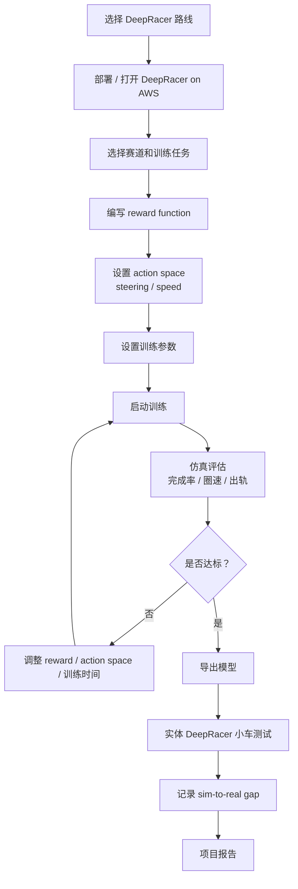

# 与 AWS DeepRacer 的比较，以及如何切换到 DeepRacer

目标：理解当前 `highway-env + PPO + AWS` 小项目和 AWS DeepRacer 的相同点、不同点，以及如果把项目改成 DeepRacer 路线，需要替换哪些部分、保留哪些学习目标、按什么步骤执行。

---

## 1. 一句话比较

当前小项目：

> 自己搭一个最小 RL/MLOps 训练闭环，用 `highway-env` 模拟高速公路决策，用 S3、ECR、SageMaker Training、Processing、Model Registry 串起训练和评估。

AWS DeepRacer：

> AWS 做好的 RL 自动驾驶赛车教学平台，提供赛车仿真、reward function、训练、评估、比赛、模型导出和实体小车部署体验。

更直白地说：

```text
我们的项目：学习 AWS 训练评估链路怎么搭
DeepRacer：学习 RL reward 和 sim-to-real 赛车体验
```

---

## 2. 相同点

| 维度 | 当前小项目 | AWS DeepRacer |
| --- | --- | --- |
| 学习主题 | 强化学习自动驾驶 | 强化学习自动驾驶赛车 |
| 训练方式 | agent 在仿真中试错学习 | agent 在 DeepRacer simulator 中试错学习 |
| Reward | YAML 配置里的 reward / 环境 reward | 用户自定义 reward function |
| 云上训练 | SageMaker Training | SageMaker AI training jobs |
| 评估 | SageMaker Processing 跑 evaluation | DeepRacer simulator 评估 |
| 模型产物 | S3 `model.tar.gz` | DeepRacer 模型，可导出 |
| sim-to-real | 文档中分析，项目未真实执行 | 可部署到实体 DeepRacer 小车 |
| 目标 | 跑通训练、评估、注册、报告 | 训练赛车完成赛道并优化圈速 |

两者都体现了 RL 的基本闭环：

```text
环境 observation
  -> agent 选择 action
  -> 环境更新
  -> reward function 给反馈
  -> policy 更新
  -> 评估模型表现
```

---

## 3. 不同点

### 3.1 抽象层级不同

当前小项目更底层：

```text
你自己管理 IaC
你自己写训练容器
你自己启动 SageMaker Training
你自己写 evaluation.py
你自己保存 evaluation_report.json
你自己注册 Model Registry
```

DeepRacer 更产品化：

```text
平台提供 UI
平台管理仿真
平台管理训练任务
平台管理模型
平台提供比赛和排行榜
平台支持实体小车部署
```

所以：

> DeepRacer 更容易上手；当前小项目更能理解背后的 AWS 工程结构。

### 3.2 任务不同

当前小项目：

```text
高速公路变道 / 跟车 / 速度控制
```

DeepRacer：

```text
赛道 racing line / 转向 / 速度 / 不出界 / 圈速优化
```

DeepRacer 的目标通常是：

```text
尽快完成赛道，不出轨，不撞障碍
```

当前小项目的目标是：

```text
理解自动驾驶 RL 训练、评估、部署决策流程
```

### 3.3 工程可见性不同

DeepRacer 封装了很多工程细节：

- job queue
- simulator application
- reward function validation
- model import/export
- training/evaluation orchestration
- simulation video streaming
- user/profile/model metadata

当前小项目暴露这些核心概念：

- S3 artifact layout
- ECR image
- SageMaker Training Job
- Processing Job
- evaluation report schema
- Model Registry
- gate decision

### 3.4 部署目标不同

当前小项目没有真实车端部署。

DeepRacer 可以下载模型并部署到 1/18 实体赛车，所以它能更直观地体验：

```text
sim-to-real gap
```

但 DeepRacer 的真实世界是小车赛道，不是真实道路自动驾驶。

---

## 4. 如果换成 DeepRacer，哪些东西会被替换

| 当前小项目模块 | 换成 DeepRacer 后 |
| --- | --- |
| `highway-env` | DeepRacer simulator |
| `train.py` | DeepRacer 平台训练流程 |
| `evaluate.py` | DeepRacer 平台评估 / 比赛结果 |
| 自定义 Dockerfile | 通常不需要自己写训练镜像 |
| 自建 SageMaker Training 脚本 | 由 DeepRacer 平台发起 |
| 自建 Processing Job | 由 DeepRacer evaluation 体验替代 |
| 自建 Model Registry | DeepRacer 管理模型版本，或导出后另行管理 |
| highway reward config | DeepRacer reward function Python 代码 |
| highway action | DeepRacer steering/speed action space |
| 高速路指标 | 圈速、完成率、出轨、碰撞、赛道进度 |

---

## 5. 哪些学习内容仍然保留

即使换成 DeepRacer，下面这些阶段仍然有价值：

| 阶段 | 是否仍然有用 | 原因 |
| --- | --- | --- |
| 第 1 阶段 系统地图 | 有用 | 帮你知道 DeepRacer 只是自动驾驶 RL 的简化教学平台 |
| 第 2 阶段 模型训练语言 | 有用 | DeepRacer 主要覆盖 RL，不覆盖完整自动驾驶多模型系统 |
| 第 3 阶段 仿真 | 非常有用 | DeepRacer 主要就是仿真训练 |
| 第 4 阶段 最小训练流程 | 非常有用 | DeepRacer 的训练流程本质一样，只是被封装 |
| 第 5 阶段 Reward | 非常有用 | DeepRacer 成败很大程度取决于 reward function |
| 第 6 阶段 评估 | 非常有用 | 需要看完成率、圈速、出轨、稳定性 |
| 第 7 阶段 sim-to-real | 非常有用 | DeepRacer 实体小车会直接暴露 sim-to-real gap |
| 第 8 阶段 真实部署 | 部分有用 | DeepRacer 部署简单很多，但仍有模型导出和实体测试 |
| 第 9 阶段 小项目 | 需要改造 | 从 highway-env 项目改成 DeepRacer 项目 |

---

## 6. 如果改用 DeepRacer，项目目标怎么改

原目标：

```text
在 highway-env 中训练一个高速公路变道 RL agent，
用 AWS 跑通训练、评估、模型注册和实验报告。
```

DeepRacer 版本目标：

```text
在 DeepRacer simulator 中训练一个赛车 RL agent，
通过 reward function 和超参数实验提升赛道完成率和圈速，
并比较虚拟评估和实体小车表现之间的 sim-to-real gap。
```

---

## 7. DeepRacer 版本项目流程



---

## 8. DeepRacer 版本需要做什么

### 8.1 准备 DeepRacer 环境

选择一种方式：

```text
AWS DeepRacer console / DeepRacer on AWS solution
```

需要关注：

- 支持区域
- 训练费用
- SageMaker 训练实例费用
- S3 存储费用
- 是否需要实体 DeepRacer 小车

### 8.2 定义训练目标

例如：

```text
目标：完成一圈并尽量缩短 lap time
约束：不出轨、不撞障碍、保持稳定速度
```

### 8.3 设计 reward function

DeepRacer 的核心工作从 YAML reward 配置变成 Python reward function。

典型 reward 目标：

- 靠近中心线
- 沿赛道方向行驶
- 避免出轨
- 根据曲率调整速度
- 鼓励完成更多 progress
- 惩罚不稳定方向盘

示例结构：

```python
def reward_function(params):
    reward = 1.0

    if not params["all_wheels_on_track"]:
        return 1e-3

    distance_from_center = params["distance_from_center"]
    track_width = params["track_width"]

    if distance_from_center <= 0.1 * track_width:
        reward += 1.0
    elif distance_from_center <= 0.25 * track_width:
        reward += 0.5
    else:
        reward *= 0.5

    reward += params["progress"] / 100.0
    return float(reward)
```

### 8.4 设计 action space

DeepRacer action space 通常关注：

```text
steering angle
speed
```

你要决定：

- 转向角范围
- 速度档位
- 动作数量
- 高速动作是否过于激进
- 弯道是否需要低速动作

### 8.5 训练和评估

每次实验记录：

```text
reward function 版本
action space
训练时间
赛道
完成率
最好圈速
平均圈速
出轨次数
模型版本
```

### 8.6 实体小车测试

如果有 DeepRacer 实体车：

```text
下载模型
部署到小车
在真实赛道测试
记录虚拟成绩和真实成绩差距
```

要记录：

- 真实赛道是否和仿真一致
- 光照是否影响摄像头
- 车速是否过快
- 转向是否抖动
- 电量是否影响表现
- 哪些弯道最容易失败

---

## 9. DeepRacer 版本项目报告

报告结构可以改成：

```text
1. 项目目标
2. DeepRacer 训练环境
3. 赛道选择
4. Reward function 版本
5. Action space 设计
6. 训练设置
7. 仿真评估结果
8. 实体小车测试结果
9. sim-to-real gap 分析
10. 下一步优化
```

对比表：

| 实验 | reward 版本 | action space | 完成率 | 最好圈速 | 出轨率 | 实体表现 |
| --- | --- | --- | --- | --- | --- | --- |
| v1 | centerline | conservative | 待填 | 待填 | 待填 | 待填 |
| v2 | progress + speed | balanced | 待填 | 待填 | 待填 | 待填 |
| v3 | racing line | aggressive | 待填 | 待填 | 待填 | 待填 |

---

## 10. 当前项目和 DeepRacer 的取舍

| 选择 | 更适合 |
| --- | --- |
| 当前项目 | 想理解 AWS MLOps、SageMaker、ECR、Processing、Model Registry 的底层训练评估链路 |
| DeepRacer | 想快速体验 RL 赛车、reward function、虚拟比赛、实体小车 sim-to-real |

如果你的学习目标是：

```text
理解自动驾驶 RL 训练和部署工程链路
```

保留当前项目更合适。

如果你的学习目标是：

```text
快速看到 RL 小车在实体世界跑起来
```

DeepRacer 更合适。

最好的组合是：

```text
先做当前项目，理解底层 AWS 训练评估链路
再做 DeepRacer，体验产品化 RL 和实体 sim-to-real
```

---

## 11. 如果真的切换，建议执行顺序

1. 保留当前 `docs/` 作为理论学习材料。
2. 暂停当前 `code/` 的 SageMaker 自建训练路线。
3. 新增 `deepracer/` 目录保存 reward functions、实验记录和报告。
4. 在 DeepRacer 中创建第一个模型。
5. 先用简单 centerline reward 跑通训练。
6. 再做 progress/speed reward 对比。
7. 如果有实体小车，下载模型并测试。
8. 写 DeepRacer 项目报告。
9. 对比当前项目和 DeepRacer 的训练、评估、部署体验。

建议目录：

```text
autodriving-rl/
  code/
  deepracer/
    reward_functions/
      reward_v001_centerline.py
      reward_v002_progress_speed.py
    experiments/
      deepracer_experiment_log.md
    reports/
      deepracer_project_report.md
  docs/
```

---

## 12. 结论

DeepRacer 可以看作当前项目的“产品化、赛车化、实体小车化”版本。

它会替你管理很多 AWS 工程细节，但也会隐藏很多我们当前项目特意暴露出来的训练和评估组件。

所以不是谁替代谁，而是两条学习路线：

```text
当前项目：理解工程底层
DeepRacer：体验 RL 产品和实体迁移
```

