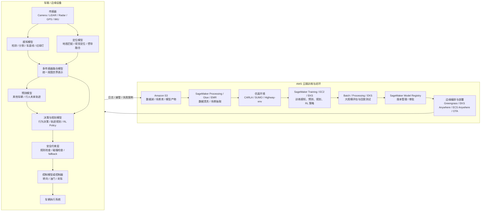

# 第 1 阶段：建立整体地图

目标：先看清楚自动驾驶系统的全貌，再理解强化学习通常放在哪些位置，以及 AWS 服务如何支撑训练、评估和部署流程。

这一阶段先不研究 PPO、DQN、SAC 这些算法细节。我们关心的是：

- 自动驾驶系统由哪些模块组成？
- RL 在自动驾驶里一般解决哪类问题？
- AWS 在自动驾驶 RL 流程里承担什么角色？
- 从数据到训练，再到部署，大致链路是什么？

---

## 1. 自动驾驶不是一个模型，而是一套系统

很多人一开始会以为自动驾驶是：

```text
摄像头输入 -> AI 模型 -> 方向盘 / 油门 / 刹车
```

真实工程通常更像这样：

```text
传感器
  -> 感知 Perception
  -> 定位 Localization
  -> 预测 Prediction
  -> 决策 / 规划 Planning
  -> 控制 Control
  -> 车辆执行 Actuation
```

每一层解决的问题不同。

| 模块 | 它回答的问题 | 常见输入 | 常见输出 |
| --- | --- | --- | --- |
| 感知 | 周围有什么？ | 摄像头、LiDAR、Radar | 车辆、行人、车道线、红绿灯、障碍物 |
| 定位 | 我在哪里？ | GPS、IMU、地图、视觉特征 | 车辆在地图中的精确位置 |
| 预测 | 其他交通参与者接下来会怎么动？ | 周围车辆和行人的历史轨迹 | 未来几秒的可能轨迹 |
| 决策 / 规划 | 我接下来应该怎么开？ | 当前位置、目标路线、预测结果、规则 | 变道、跟车、停车、轨迹 |
| 控制 | 如何执行规划结果？ | 目标轨迹、车辆状态 | 方向盘角度、油门、刹车 |

第一阶段最重要的认知是：

> 自动驾驶不是单个模型端到端完成全部事情，而是一套分层系统。强化学习通常更常出现在决策、规划、控制、仿真优化这些位置。

### 1.1 系统构成图：不只是一个模型

下面这张图是学习用的系统地图。真实公司会有不同实现，但大方向相似：



先抓住这句话：

> 自动驾驶车端运行的是一组模型、规则系统和运行时服务的组合；AWS 云端负责让这些模型可以被训练、评估、注册、部署和持续改进。

### 1.2 自动驾驶常见模型清单

下面列的是常见模型类型。它们不一定每家公司都完全一样，但足够帮助你建立系统地图。

| 模型 / 模块 | 作用 | 常见训练方式 | 与其他模型如何互动 |
| --- | --- | --- | --- |
| 目标检测模型 | 找出车辆、行人、骑行者、交通锥、障碍物 | 用标注图像或点云做监督学习 | 输出目标框，给融合、预测、规划使用 |
| 语义分割模型 | 判断每个像素属于道路、车道、人行道、障碍物等 | 用像素级标注做监督学习 | 帮助理解可行驶区域，给规划模块提供边界 |
| 车道线检测模型 | 识别车道线、道路边界、可行驶车道 | 用标注图像、地图数据训练 | 给定位、规划、控制提供车道结构 |
| 红绿灯 / 标志识别模型 | 识别交通灯状态、限速牌、停止牌等 | 用图像分类、检测数据训练 | 给规则系统和规划模块提供交通规则输入 |
| 多传感器融合模型 | 把 camera、LiDAR、radar 的结果统一成一个环境表示 | 监督学习、时序融合、规则融合结合 | 给预测和规划提供更稳定的世界状态 |
| 定位模型 | 判断自车在地图中的精确位置 | 视觉定位、地图匹配、传感器融合训练 | 让规划知道自己在哪条路、哪个车道 |
| 轨迹预测模型 | 预测其他车、行人未来几秒可能怎么动 | 用历史交通轨迹做监督学习或生成式建模 | 规划模块根据预测结果决定避让、跟车、变道 |
| 行为决策模型 | 判断保持车道、变道、让行、停车、汇入等高层动作 | 模仿学习、规则系统、RL、混合方法 | 接收感知、定位、预测结果，输出驾驶意图 |
| 轨迹规划模型 | 生成未来几秒自车应该走的轨迹 | 优化方法、模仿学习、RL 或混合方法 | 把高层决策变成可执行路径，交给控制层 |
| 控制模型 / 控制器 | 把目标轨迹变成方向盘、油门、刹车 | 传统控制、系统辨识、部分场景可用 RL | 执行规划结果，同时受车辆动力学限制 |
| 安全检查模型 / 规则层 | 判断动作是否安全、合法、可执行 | 通常是规则、约束、验证系统，也可结合学习模型 | 包在规划和控制外层，必要时否决 RL 或规划输出 |
| 仿真交通参与者模型 | 在仿真里模拟其他车辆、行人行为 | 真实轨迹模仿学习、多智能体 RL、规则模型 | 生成训练和评估场景，帮助测试自车策略 |
| 风险评估模型 | 判断当前场景是否危险、是否需要降级或接管 | 用历史事故、接管、近碰撞数据训练 | 给安全层、监控系统和数据闭环提供信号 |
| 场景挖掘模型 | 从海量日志中找出有价值的 corner cases | 异常检测、聚类、规则筛选、监督学习 | 把失败案例送回 S3 场景库，用于再训练和评估 |

这里最容易混淆的是“规划模型”和“控制模型”：

- 规划模型决定“接下来走哪条轨迹”。
- 控制模型决定“怎么打方向盘、踩油门、踩刹车来跟上这条轨迹”。

RL 更常进入的是行为决策、轨迹规划、复杂控制、仿真交通参与者这些位置，而不是替代所有模型。

### 1.3 这些模型如何一起工作

一个简化的车端推理流程如下：

```text
1. 传感器采集原始数据
   Camera / LiDAR / Radar / GPS / IMU

2. 感知模型理解周围世界
   检测车辆、行人、红绿灯、车道线、障碍物

3. 定位模型确定自车位置
   我在哪条路、哪个车道、离目标路线多远

4. 融合模块形成统一环境表示
   把不同传感器和模型输出合并成一份 world state

5. 预测模型判断其他交通参与者未来怎么动
   前车是否会急刹，旁车是否可能并线，行人是否可能横穿

6. 决策 / 规划模型决定自车怎么动
   保持车道、变道、让行、停车、生成目标轨迹

7. 安全层检查规划结果
   是否会碰撞，是否违规，是否超出车辆能力边界

8. 控制器执行轨迹
   输出方向盘、油门、刹车命令

9. 日志系统记录关键数据
   成功、失败、接管、异常、低置信度场景
```

这里的关键互动关系是：

- 感知模型如果识别错了，预测和规划都会受影响。
- 预测模型如果低估旁车变道概率，规划可能做出危险决策。
- RL policy 如果输出激进动作，安全层需要能拦住。
- 控制器如果无法执行规划轨迹，规划层需要重新规划。
- 车端日志会回传云端，进入下一轮训练和评估。

### 1.4 各类模型如何在 AWS 上训练

从 AWS 视角看，不同模型虽然任务不同，但训练闭环有相似结构：

```text
数据进入 S3
  -> 清洗、标注、切片
  -> SageMaker / EC2 / EKS 训练
  -> S3 保存模型和指标
  -> Processing / Batch 做评估
  -> Model Registry 管理版本
  -> Greengrass / EKS Anywhere / ECS Anywhere / IoT Jobs 部署到边缘
  -> 日志回传 S3
```

不同模型对应的训练数据不同：

| 模型类型 | 主要训练数据 | AWS 训练与评估重点 |
| --- | --- | --- |
| 感知模型 | 图像、点云、目标框、分割 mask | S3 存数据，SageMaker 训练，Ground Truth 标注 |
| 定位模型 | GPS / IMU / 地图 / 视觉特征 | S3 存路线和传感器数据，Processing 做离线评估 |
| 预测模型 | 交通参与者历史轨迹和未来轨迹 | SageMaker 训练时序模型，Batch 跑多场景评估 |
| 决策 / RL 策略 | 仿真交互数据、奖励、状态动作轨迹 | SageMaker / EKS 跑 RL 训练，S3 保存 checkpoint |
| 规划模型 | 人类驾驶轨迹、规则、仿真评估结果 | Processing 做回放，Batch 做场景压力测试 |
| 控制模型 | 车辆状态、轨迹误差、执行命令 | EC2 / SageMaker 训练或调参，仿真检查稳定性 |
| 安全 / 风险模型 | 接管、近碰撞、违规、异常日志 | S3 + Athena 分析，Processing 评估召回率 |
| 场景挖掘模型 | 海量运行日志、失败案例、低置信度片段 | Glue / EMR / Athena 筛选，S3 形成场景库 |

所以你可以把 AWS 训练平台理解成：

> 不是只训练一个 RL 模型，而是同时支撑感知、预测、规划、控制、安全、仿真和场景挖掘等多个模型的训练与版本管理。

### 1.5 RL policy 和其他模型的关系

RL policy 在系统里通常不是“最高权力”。

更合理的理解是：

```text
感知 / 定位 / 预测
      |
      v
RL policy 或规划策略
      |
      v
安全层检查
      |
      v
控制器执行
```

例如在高速变道任务中：

```text
感知模型：左侧车道有一辆车，距离 25 米
预测模型：左侧车未来 3 秒可能加速接近
RL policy：为了效率，建议左变道
安全层：判断变道风险过高，否决
规划器：改为保持车道并稍微减速
控制器：执行减速和保持车道
```

这说明：

> RL 可以提出决策，但真实自动驾驶系统需要规则、安全约束、预测模型和控制器共同决定最终动作。

### 1.6 Greengrass 不等于车端完整编排系统

如果车端只有少量边缘组件，例如：

- 采集日志
- 过滤高价值数据
- 运行一个轻量推理组件
- 管理配置
- 做简单 OTA 更新
- 在断网时继续执行本地逻辑

那么 AWS IoT Greengrass 是合理的候选。它更像“边缘设备运行时 + 组件部署管理 + 云端连接”。

但如果车端要协调的是一整套自动驾驶软件栈，例如：

```text
感知容器
预测容器
规划容器
控制容器
安全检查服务
日志服务
监控服务
模型版本服务
传感器适配服务
仿真回放服务
```

这就已经接近容器平台或车载中间件的问题。仅靠 Greengrass 管全部模块会显得太轻，尤其是在这些需求出现时：

- 多个容器之间有复杂依赖
- 需要 GPU / NPU / accelerator 资源调度
- 需要服务发现、健康检查、重启策略
- 需要灰度发布和快速回滚
- 需要同时运行多个模型版本
- 需要对感知、预测、规划、控制分别做生命周期管理
- 需要本地高可靠、低延迟通信
- 需要和 ROS 2、DDS、AUTOSAR Adaptive 或自研车载中间件协同

更合理的分层理解是：

| 层级 | 更适合的工具 | 作用 |
| --- | --- | --- |
| 车端实时执行层 | ROS 2、DDS、AUTOSAR Adaptive、自研 runtime | 管理自动驾驶核心进程、实时通信、传感器数据流 |
| 车端容器编排层 | Kubernetes、K3s、EKS Anywhere、ECS Anywhere、自研容器平台 | 管理多个容器、资源、健康检查、版本、回滚 |
| IoT 设备管理层 | AWS IoT Greengrass、AWS IoT Core、IoT Jobs | 管理设备连接、配置下发、组件更新、日志回传 |
| 云端训练与评估层 | SageMaker、EC2、EKS、Batch、S3 | 训练模型、跑仿真、做批量评估、保存模型产物 |
| 云端模型治理层 | SageMaker Model Registry、CloudTrail、IAM | 管模型版本、审批、审计、发布权限 |

所以更准确的说法是：

> Greengrass 可以参与边缘部署和设备管理，但不应该被理解为完整自动驾驶运行时的唯一编排系统。复杂自动驾驶软件栈更可能需要 Kubernetes 级别的容器管理、车载中间件，以及专门的实时安全架构。

一个更贴近工程现实的边缘部署图是：

```text
AWS 云端
  SageMaker / EKS / Batch / S3 / Model Registry
        |
        v
发布系统
  IoT Jobs / OTA / 镜像仓库 / 模型仓库
        |
        v
车端平台
  Kubernetes / K3s / EKS Anywhere / ECS Anywhere / 自研编排
        |
        v
车载运行时
  ROS 2 / DDS / AUTOSAR Adaptive / 自研 middleware
        |
        v
自动驾驶服务
  感知 / 融合 / 定位 / 预测 / 规划 / 安全 / 控制
```

对于我们这个学习项目，可以先这样记：

- Greengrass：适合讲“边缘设备管理、组件部署、数据回传”。
- Kubernetes / EKS Anywhere / ECS Anywhere：适合讲“多个容器化模型和服务的编排”。
- 车载中间件：适合讲“低延迟、高可靠、实时数据流”。
- SageMaker / EKS / Batch：适合讲“云端训练、仿真、评估”。

---

## 2. RL 在自动驾驶里通常不负责“看见世界”

强化学习不一定是用来识别图像的。

例如，识别行人、车道线、交通灯，通常更适合用监督学习、视觉模型、检测模型、分割模型。

RL 更常被用于这类问题：

- 当前是否应该变道？
- 什么时候并入主路？
- 在复杂路口如何礼让或通行？
- 跟车距离应该如何调整？
- 遇到旁车强行并线时应该刹车还是避让？
- 如何在安全、效率、舒适之间做权衡？
- 在仿真环境中如何优化驾驶策略？

也就是说，RL 关注的是：

```text
在当前状态下，选择哪个行动，能让长期结果更好？
```

对自动驾驶来说，“长期结果更好”通常意味着：

- 更安全
- 更少违规
- 更舒适
- 更快到达目的地
- 更少急刹和急转
- 更能处理复杂交通互动

---

## 3. 一个自动驾驶 RL 问题怎么表达

把自动驾驶翻译成 RL 语言，大概是这样：

| RL 概念 | 自动驾驶对应物 |
| --- | --- |
| Agent | 自车，也就是自动驾驶车辆 |
| Environment | 道路、交通、其他车、行人、天气、规则 |
| State / Observation | 自车速度、车道、前后车距离、交通灯、周围目标 |
| Action | 加速、减速、保持车道、左变道、右变道、停车 |
| Reward | 安全、到达目标、保持速度、舒适、守规则 |
| Penalty | 碰撞、闯红灯、压线、急刹、危险距离 |
| Policy | 在某个状态下选择动作的驾驶策略 |
| Episode | 一次完整驾驶任务，比如从入口汇入高速并到达出口 |

一个简化的 RL 驾驶循环：

```text
1. 车辆观察当前交通状态
2. 策略选择动作，例如加速或变道
3. 仿真环境更新道路和车辆状态
4. 系统给出奖励或惩罚
5. 车辆继续观察新的状态
6. 重复很多次后，策略逐渐改进
```

这和监督学习的区别很大。

监督学习更像：

```text
这个场景下，人类司机踩了刹车，所以模型学习踩刹车
```

强化学习更像：

```text
车辆尝试了不同动作，发现某些选择会更安全、更高效，于是以后更倾向选择这些动作
```

---

## 4. AWS 在这里扮演什么角色

AWS 不是自动驾驶算法本身。它更像是一套云上工程底座，支撑数据、仿真、训练、评估、模型管理、边缘部署和持续迭代。

可以先记住这张大图：

```text
车辆 / 传感器 / 日志
      |
      v
Amazon S3 数据湖
      |
      v
数据处理与场景构建
      |
      v
仿真环境
      |
      v
SageMaker / EC2 / EKS 训练 RL 策略
      |
      v
批量评估与安全验证
      |
      v
Model Registry 模型版本管理
      |
      v
边缘编排 / 设备管理 / 车端部署
      |
      v
日志回传，进入下一轮训练
```

---

## 5. 自动驾驶模块与 AWS 服务的对应关系

下面不是唯一架构，而是一个学习用的参考地图。

| 自动驾驶环节 | 主要任务 | 可能用到的 AWS 服务 |
| --- | --- | --- |
| 数据采集 | 上传车辆日志、传感器数据、接管记录 | AWS IoT Core、AWS IoT Greengrass、Kinesis、S3 |
| 数据湖 | 存储原始数据、仿真数据、训练样本、模型 | Amazon S3、Lake Formation |
| 数据处理 | 清洗数据、抽取场景、生成训练样本 | AWS Glue、EMR、Athena、SageMaker Processing |
| 标注与场景库 | 标注目标、整理 corner cases | SageMaker Ground Truth、S3、DynamoDB |
| 仿真 | 构建道路、交通、天气、危险场景 | EC2、EKS、ECS、AWS Batch、S3 |
| RL 训练 | 在仿真中训练决策策略 | SageMaker Training、EC2 GPU、EKS、ECR |
| 实验管理 | 记录参数、指标、模型产物 | SageMaker Experiments、CloudWatch、S3 |
| 批量评估 | 跑大量场景测试模型稳定性 | SageMaker Processing、AWS Batch、EKS |
| 模型审批 | 管理模型版本和发布状态 | SageMaker Model Registry、IAM、CloudTrail |
| 边缘部署 | 把模型部署到车端或边缘设备 | AWS IoT Greengrass、EKS Anywhere、ECS Anywhere、ECR、S3、IoT Jobs |
| 运行监控 | 收集日志、异常、性能指标 | CloudWatch、IoT Device Defender、Kinesis |
| 持续迭代 | 失败案例回流，再训练再评估 | Step Functions、SageMaker Pipelines、S3 |

先不要试图一次记住所有服务。第一阶段只需要形成直觉：

> S3 管数据，SageMaker 管训练和评估，EC2/EKS/Batch 管大规模计算，Greengrass / IoT Jobs 管设备侧组件更新和数据回传，Kubernetes / EKS Anywhere / ECS Anywhere 更适合复杂容器编排，CloudWatch 管日志监控。

---

## 6. RL 更可能出现在哪些自动驾驶模块

### 6.1 决策层

典型问题：

```text
是否变道？
是否让行？
是否并入主路？
是否超车？
是否等待行人？
```

这类问题不是简单识别，而是权衡：

```text
安全 vs 效率
舒适 vs 激进
规则约束 vs 交通互动
当前动作 vs 长期结果
```

RL 很适合表达这种长期决策问题。

AWS 对应视角：

- 用 S3 存储历史驾驶场景
- 用仿真器生成大量交互场景
- 用 SageMaker 或 EKS 训练策略
- 用 Batch 或 Processing Jobs 做批量评估

### 6.2 规划层

规划层关心：

```text
车接下来几秒应该沿着哪条轨迹走？
```

RL 可以帮助策略在复杂交通互动中选择更合理的轨迹倾向，比如：

- 更早减速
- 更晚变道
- 保持安全距离
- 避免频繁横向摆动

但真实系统通常不会让 RL 单独决定一切。它往往会和规则规划器、安全检查器结合。

AWS 对应视角：

- 训练多个候选策略
- 在海量仿真场景中比较它们
- 把通过评估的模型注册到 Model Registry

### 6.3 控制层

控制层负责：

```text
如何把目标轨迹变成方向盘、油门、刹车？
```

RL 有时可以用于复杂控制，尤其是在车辆动力学复杂或环境变化大的情况下。

但在安全要求很高的工程系统中，传统控制方法仍然非常重要。RL 策略一般需要被安全约束包住。

AWS 对应视角：

- 用仿真环境测试控制稳定性
- 用评估任务检查急刹、急转、轨迹偏差
- 用 CloudWatch 和 S3 保存评估日志

### 6.4 仿真中的其他交通参与者

RL 也可以用来训练“其他车”的行为，让仿真更接近真实交通。

例如：

- 旁车强行并线
- 前车突然急刹
- 路口车辆互相试探
- 行人犹豫后突然横穿

这类多智能体环境对自动驾驶评估很重要。

AWS 对应视角：

- 使用 EKS、ECS 或 Batch 并行运行大量仿真
- 将产生的 corner cases 存入 S3 场景库
- 把失败场景加入下一轮训练和评估

---

## 7. 为什么第 1 阶段要先学系统地图

如果一开始就学 RL 算法，很容易陷入这些细节：

- 策略梯度怎么推？
- value function 是什么？
- PPO 的 clipped objective 是什么？
- Q-learning 如何更新？

这些以后可以学，但对你的目标不是最优先。

你的目标是理解自动驾驶训练和部署过程，所以第一优先级是知道：

```text
真实驾驶数据在哪里？
仿真环境在哪里？
RL 策略在哪里训练？
训练完如何评估？
为什么不能直接上车？
如何部署到边缘？
部署后数据如何回流？
```

这就是系统地图。

---

## 8. 一个贴近 AWS 的端到端流程

下面是一条简化但完整的自动驾驶 RL 工程流程：

```text
1. 车辆采集驾驶日志
   -> IoT Core / Greengrass / Kinesis

2. 原始数据进入数据湖
   -> S3

3. 数据清洗、切片、抽取危险场景
   -> Glue / EMR / SageMaker Processing

4. 构建仿真场景库
   -> S3 + 仿真器配置

5. 并行运行仿真并训练 RL 策略
   -> SageMaker Training / EC2 / EKS

6. 保存模型 checkpoint 和训练日志
   -> S3 + CloudWatch

7. 对模型进行批量评估
   -> Batch / SageMaker Processing / EKS

8. 评估通过后注册模型
   -> SageMaker Model Registry

9. 部署到边缘设备或车端测试环境
   -> IoT Greengrass / IoT Jobs / EKS Anywhere / ECS Anywhere / ECR

10. 收集运行日志和失败案例
   -> CloudWatch / Kinesis / S3

11. 回到数据处理和仿真场景库
   -> 下一轮训练
```

这条链路的关键词是：

```text
数据闭环
仿真训练
批量评估
安全审批
边缘部署
持续迭代
```

---

## 9. 第一阶段你需要掌握到什么程度

完成本阶段后，你应该能解释：

- 自动驾驶系统不是单一模型，而是感知、定位、预测、规划、控制的组合。
- RL 通常更适合决策、规划、控制和仿真交互，不是主要用来做图像识别。
- 自动驾驶 RL 训练通常依赖仿真，因为真实道路不能随便试错。
- AWS 的作用是支撑大规模数据、仿真、训练、评估、模型管理、边缘部署和日志回流。
- 真正部署时，RL policy 外面还会有规则、安全层、监控和审批流程。

如果你能把下面这句话讲清楚，第 1 阶段就达标了：

> 自动驾驶 RL 不是“把一个模型丢进车里让它自己开”，而是在云上通过真实数据和仿真场景训练一个决策策略，再经过大规模评估、安全约束、模型审批和边缘部署，最后通过日志回流持续改进。

---

## 10. 本阶段小练习

### 练习 1：画系统图

尝试用自己的话画出这条链路：

```text
车辆数据 -> S3 -> 仿真 -> SageMaker 训练 -> 批量评估 -> Model Registry -> 边缘编排 / 设备管理 -> 日志回流
```

要求不用画得复杂，只要能说明每一步在做什么。

### 练习 2：判断 RL 适合的位置

下面哪些更适合 RL？哪些更适合监督学习？

| 任务 | 更可能的方法 |
| --- | --- |
| 识别红绿灯颜色 | 监督学习 / 视觉模型 |
| 判断是否应该变道 | RL / 规划策略 |
| 检测行人位置 | 监督学习 / 检测模型 |
| 在匝道并入高速 | RL / 规则规划 / 混合方法 |
| 判断前车未来轨迹 | 预测模型，可能结合学习方法 |
| 控制车辆平稳跟踪轨迹 | 控制算法，部分场景可结合 RL |

### 练习 3：用 AWS 服务解释流程

用一句话解释下面服务在本主题中的作用：

| AWS 服务 | 一句话解释 |
| --- | --- |
| S3 | 存储驾驶数据、仿真场景、训练样本和模型产物 |
| SageMaker Training | 运行感知、预测、规划、RL 等模型训练任务 |
| SageMaker Processing | 做离线数据处理和模型评估 |
| EKS / ECS / Batch | 并行运行大量仿真或评估任务 |
| CloudWatch | 收集训练、评估和部署日志 |
| Model Registry | 管理模型版本和审批状态 |
| IoT Greengrass | 管理边缘设备组件、配置、数据过滤和云端连接 |
| EKS Anywhere / ECS Anywhere | 在自有或边缘基础设施上管理更复杂的容器化工作负载 |

---

## 11. 下一阶段预告

第 2 阶段会进入“不同模型训练的基本语言”。

```text
输入 / 输出
标签 / 监督信号
损失函数
指标
训练集 / 验证集 / 测试集
在线推理 / 离线评估
checkpoint / artifact / registry
仿真交互 / reward / policy
```

我们会先理解感知模型、预测模型、规划模型、控制模型、安全模型、场景挖掘模型、RL policy 各自是怎么训练的。RL 仍然会讲，但它会被放在“多模型训练体系”的位置里，而不是一上来就只讲 RL。
