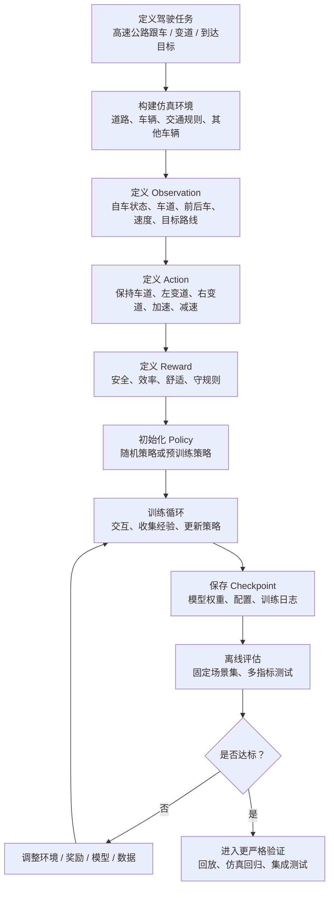
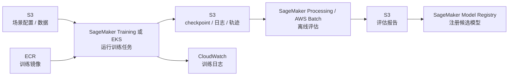
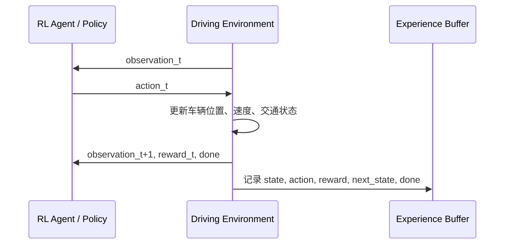
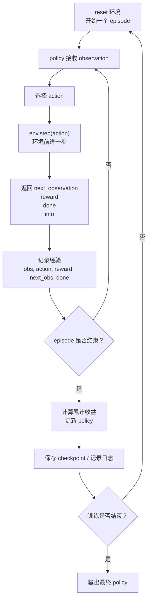
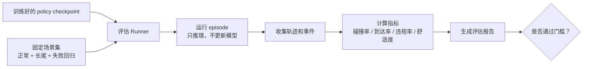
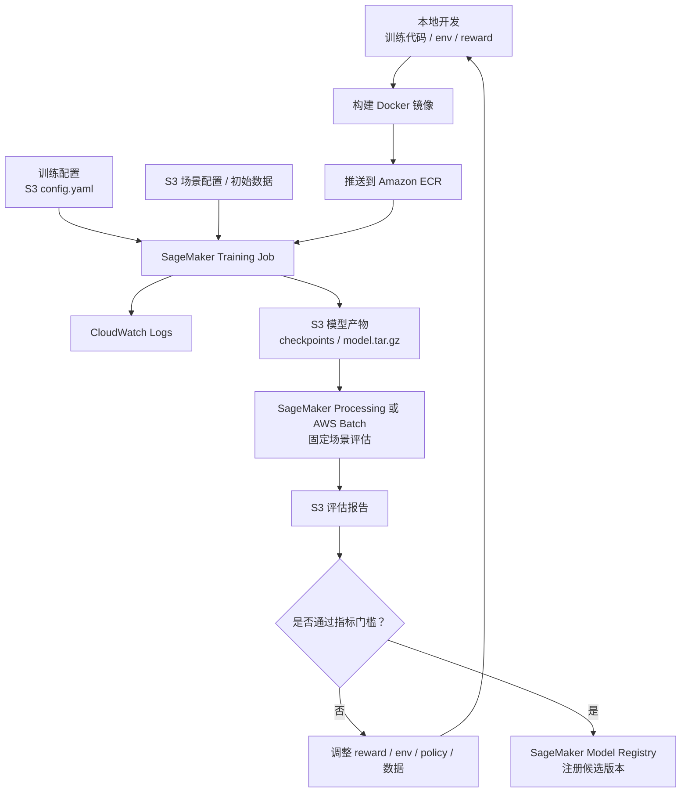

# 第 4 阶段：看懂一个最小训练流程

目标：通过一个最小的自动驾驶 RL 例子，看懂训练到底发生了什么。重点不是研究算法公式，而是理解一个训练任务如何从“定义驾驶问题”走到“得到一个可评估的策略模型”。

本阶段用一个简化任务作为主线：

> 高速公路自动变道 agent：车辆在多车道高速上行驶，需要在不碰撞、不违规、尽量舒适的前提下保持较高通行效率。

---

## 1. 最小训练流程总览

一个最小 RL 训练流程可以看成：

```text
定义任务
  -> 创建仿真环境
  -> 定义状态 observation
  -> 定义动作 action
  -> 定义奖励 reward
  -> 选择训练算法
  -> 运行训练循环
  -> 保存模型 checkpoint
  -> 离线评估
  -> 对比指标
  -> 决定是否进入下一阶段验证
```

流程图如下：



在 AWS 上对应为：



---

## 2. 第一步：定义驾驶任务

最小任务不要一开始做“完整自动驾驶”。我们先选一个足够小、但能体现 RL 特点的任务。

示例任务：

```text
场景：多车道高速公路
自车：从当前位置向前行驶
目标：安全、高效、舒适地开一段距离
限制：不能碰撞，不能频繁变道，不能速度过慢或过快
其他车辆：在相邻车道和前方行驶，可能加速、减速、变道
```

这个任务足够小，但已经包含自动驾驶决策的核心问题：

- 是否跟车？
- 是否变道？
- 什么时候加速？
- 什么时候减速？
- 是否为了效率冒更高风险？
- 是否为了安全牺牲速度？

注意：这里训练的不是完整自动驾驶系统，而是一个简化的决策 policy。

---

## 3. 第二步：创建仿真环境

RL 训练必须有环境，因为 agent 要和环境交互。

环境负责：

```text
接收 action
更新交通状态
返回 observation
计算 reward
判断 episode 是否结束
```

一个最小环境需要包含：

| 环境元素 | 示例 |
| --- | --- |
| 道路 | 3 条车道，直线高速 |
| 自车 | 当前车道、位置、速度 |
| 其他车辆 | 前车、后车、相邻车道车辆 |
| 规则 | 不碰撞、不超速、不越界 |
| 时间步 | 每 0.1 秒或 1 秒更新一次 |
| 结束条件 | 碰撞、到达目标距离、超时 |

环境循环可以表示为：



常见选择：

- 学习入门：`highway-env`
- 复杂 3D 场景：`CARLA`
- 大规模交通流：`SUMO`
- 多场景 RL：`MetaDrive`

本阶段建议先理解 `highway-env` 级别的简化环境。

---

## 4. 第三步：定义 Observation

Observation 是 agent 每一步能看到的信息。

在真实自动驾驶里，observation 可能来自感知、融合、定位、预测模型。  
在最小仿真环境里，我们通常直接给结构化状态。

示例 observation：

```text
自车速度
自车所在车道
自车横向位置
前车距离
前车相对速度
左侧车道最近车辆距离
右侧车道最近车辆距离
目标速度
目标路线
```

可以写成向量：

```text
[
  ego_speed,
  ego_lane_id,
  front_vehicle_distance,
  front_vehicle_relative_speed,
  left_front_distance,
  left_rear_distance,
  right_front_distance,
  right_rear_distance,
  target_speed
]
```

也可以写成更接近自动驾驶系统的结构：

```text
ego:
  lane_id: 1
  speed: 28 m/s
  acceleration: 0.2 m/s^2

nearby_vehicles:
  front:
    distance: 35 m
    relative_speed: -3 m/s
  left_front:
    distance: 18 m
    relative_speed: 2 m/s
  right_rear:
    distance: 12 m
    relative_speed: 5 m/s

route:
  target_lane: 1
  target_speed: 30 m/s
```

关键点：

> Observation 不是越多越好，而是要足够表达决策所需信息，并且训练和部署时格式一致。

---

## 5. 第四步：定义 Action

Action 是 agent 能做的动作。

最小高速公路例子可以用离散动作：

| Action ID | 动作 |
| --- | --- |
| 0 | 保持当前行为 |
| 1 | 加速 |
| 2 | 减速 |
| 3 | 左变道 |
| 4 | 右变道 |

也可以用连续动作：

```text
steering_angle
acceleration
```

两者区别：

| 类型 | 优点 | 缺点 |
| --- | --- | --- |
| 离散动作 | 容易理解，适合入门和高层决策 | 动作不够细腻 |
| 连续动作 | 更接近真实控制 | 训练更难，安全约束更复杂 |

对于本阶段，建议用离散动作理解流程。

真实系统中，RL policy 很少直接输出方向盘和油门。更常见是：

```text
RL policy 输出高层决策
  -> 规划器生成轨迹
  -> 安全层检查
  -> 控制器执行
```

---

## 6. 第五步：定义 Reward

Reward 是 RL 训练最关键也最容易出问题的部分。

一个最小 reward 可以包含：

```text
安全奖励 / 惩罚
效率奖励
舒适性惩罚
规则惩罚
到达目标奖励
```

示例：

```text
reward =
  + 1.0 * speed_score
  + 0.5 * lane_keeping_score
  - 5.0 * unsafe_distance_penalty
  - 2.0 * lane_change_penalty
  - 3.0 * hard_brake_penalty
  - 100.0 * collision_penalty
```

更直观地写：

| 行为 / 结果 | Reward |
| --- | --- |
| 保持合理速度 | +1 |
| 安全超过慢车 | +2 |
| 到达目标距离 | +50 |
| 轻微变道成本 | -1 |
| 急刹 | -5 |
| 跟车太近 | -10 |
| 碰撞 | -100 |
| 越界 / 违规 | -50 |

Reward 设计会直接塑造驾驶风格。

| Reward 偏向 | 可能结果 |
| --- | --- |
| 速度奖励太高 | agent 变得激进 |
| 碰撞惩罚太低 | agent 愿意冒险 |
| 安全惩罚太高 | agent 不敢动 |
| 变道惩罚太高 | agent 不愿超车 |
| 舒适惩罚太低 | agent 可能频繁急刹急转 |

所以 reward 不是“随便写一个分数”，而是在表达：

> 我们希望什么驾驶行为被鼓励，什么行为绝对不能接受。

---

## 7. 第六步：选择训练算法

本阶段不深入算法公式，只需要知道不同算法适合不同动作空间。

| 算法 | 更适合 | 简单理解 |
| --- | --- | --- |
| DQN | 离散动作 | 学每个动作的价值 |
| PPO | 离散或连续动作 | 稳定地优化 policy，常用于入门和工程实验 |
| SAC | 连续动作 | 适合连续控制，探索能力强 |
| Imitation Learning | 有人类驾驶数据 | 先学人类怎么开 |
| Offline RL | 有大量历史数据 | 尽量不靠在线试错 |

最小高速公路变道任务可以先用：

```text
highway-env + PPO
```

原因：

- 环境简单
- PPO 工程上常见
- 容易看到训练曲线
- 可以先理解流程，再学算法细节

---

## 8. 第七步：运行训练循环

训练循环是整个 RL 的核心。

伪代码如下：

```python
env = make_driving_env()
policy = initialize_policy()

for episode in range(num_episodes):
    obs = env.reset()
    done = False

    while not done:
        action = policy.choose_action(obs)
        next_obs, reward, done, info = env.step(action)

        policy.store(obs, action, reward, next_obs, done)
        obs = next_obs

    policy.update()
    save_checkpoint_if_needed(policy)
```

如果是 PPO，实际会更像：

```text
1. 用当前 policy 跑一批 episode
2. 收集 observation、action、reward、done
3. 计算每一步动作带来的长期收益估计
4. 更新 policy，让高收益动作更可能被选择
5. 重复下一批 episode
```

训练循环图：



---

## 9. 第八步：训练中看什么日志

训练不是跑完才看结果，中间要看日志。

常见训练日志：

| 日志 | 含义 |
| --- | --- |
| episode_reward | 每个 episode 累计 reward |
| average_reward | 最近一批 episode 平均 reward |
| collision_rate | 碰撞比例 |
| success_rate | 到达目标比例 |
| average_speed | 平均速度 |
| lane_change_count | 变道次数 |
| hard_brake_count | 急刹次数 |
| episode_length | 每次任务持续多久 |
| policy_loss | policy 更新相关损失 |
| value_loss | value function 估计误差 |

注意：reward 变高不一定代表模型真的更安全。

可能出现：

```text
reward 上升
但 agent 学会钻 reward 漏洞
例如一直慢慢开，避免风险，却没有效率
```

所以必须同时看业务指标：

```text
碰撞率
到达率
违规率
舒适性
通行效率
```

---

## 10. 第九步：保存 Checkpoint 和 Artifact

训练中会定期保存 checkpoint。

checkpoint 通常包括：

- 模型权重
- 训练配置
- 环境配置
- reward 配置
- 训练步数
- 随机种子
- 依赖版本
- 训练指标

为什么要保存这些？

因为你需要能回答：

```text
这个模型是用哪批数据训练的？
用的是哪个 reward？
在哪个仿真版本上跑的？
训练了多少步？
指标是多少？
能不能复现？
```

在 AWS 上：

```text
S3 保存 checkpoint 和 artifact
CloudWatch 保存训练日志
SageMaker Experiments 记录实验参数
Model Registry 管理候选模型版本
```

最小目录结构可以是：

```text
s3://bucket/autodriving-rl/
  experiments/
    highway-ppo-v001/
      config.yaml
      checkpoints/
      train_logs/
      evaluation/
      model.tar.gz
```

---

## 11. 第十步：离线评估

训练结束后，不要直接说“模型好了”。  
要把模型放到固定评估场景中测试。

评估流程：

```text
1. 加载训练好的 policy
2. 加载固定评估场景集
3. 禁止继续训练，只做推理
4. 跑 N 个 episode
5. 统计指标
6. 和 baseline / 上一个版本比较
```

评估图：



最小评估指标：

| 指标 | 说明 |
| --- | --- |
| success_rate | 是否顺利完成任务 |
| collision_rate | 是否发生碰撞 |
| average_reward | 平均累计 reward |
| average_speed | 是否效率合理 |
| hard_brake_count | 是否过于激进或不舒适 |
| unsafe_distance_rate | 是否经常跟车太近 |
| lane_change_count | 是否频繁变道 |

比单一 reward 更重要的是多指标平衡。

---

## 12. 第十一步：和 Baseline 对比

RL policy 训练出来后，需要和 baseline 比。

常见 baseline：

- 规则策略：保持车道 + 安全距离控制
- 人类驾驶轨迹
- 旧版本模型
- 模仿学习模型
- 不变道策略

对比示例：

| 策略 | 到达率 | 碰撞率 | 平均速度 | 急刹次数 | 评价 |
| --- | --- | --- | --- | --- | --- |
| 规则策略 | 92% | 0.5% | 23 m/s | 12 | 安全但慢 |
| RL v1 | 95% | 2.0% | 29 m/s | 38 | 快但激进 |
| RL v2 | 96% | 0.7% | 27 m/s | 18 | 更平衡 |

这类表比“reward 多少”更容易解释模型是否真的可用。

---

## 13. 最小 AWS 训练流水线

现在把最小流程映射到 AWS。



最小 AWS 组件：

| 组件 | 作用 |
| --- | --- |
| S3 | 保存配置、场景、checkpoint、评估报告 |
| ECR | 保存训练镜像 |
| SageMaker Training | 运行训练任务 |
| CloudWatch | 查看训练日志 |
| SageMaker Processing | 跑离线评估 |
| Model Registry | 注册通过评估的模型 |

如果仿真需要很多并行实例，可以用：

- AWS Batch
- EKS
- EC2 Auto Scaling

---

## 14. 最小训练配置应该包含什么

训练配置不要散落在代码里。应该有一个配置文件。

示例：

```yaml
experiment_name: highway_ppo_v001

environment:
  name: highway-env
  lanes: 3
  vehicles_count: 30
  episode_duration: 40
  target_speed: 30

observation:
  type: structured
  features:
    - ego_speed
    - ego_lane_id
    - front_distance
    - front_relative_speed
    - left_front_distance
    - left_rear_distance
    - right_front_distance
    - right_rear_distance

action:
  type: discrete
  actions:
    - keep_lane
    - accelerate
    - decelerate
    - lane_change_left
    - lane_change_right

reward:
  speed_weight: 1.0
  collision_penalty: -100.0
  unsafe_distance_penalty: -10.0
  lane_change_penalty: -1.0
  hard_brake_penalty: -5.0

training:
  algorithm: PPO
  total_timesteps: 1000000
  seed: 42
  checkpoint_interval: 50000

evaluation:
  episodes: 1000
  max_collision_rate: 0.01
  min_success_rate: 0.95
  max_hard_brake_count: 20
```

这个配置的价值是：

- 可复现
- 可比较
- 可审计
- 可自动化
- 方便在 AWS 上作为参数传入训练任务

---

## 15. 最小训练流程里最容易犯的错误

### 15.1 只看 reward，不看安全指标

高 reward 不一定安全。必须看碰撞率、违规率、急刹次数。

### 15.2 reward 设计有漏洞

例如速度奖励太高，agent 学会危险超车。

### 15.3 训练场景太简单

只在低车流训练，到了高车流就失效。

### 15.4 评估场景和训练场景重复

模型可能只是记住训练场景，而不是学会泛化。

### 15.5 没有 baseline

没有规则策略或旧版本对比，就不知道 RL 是否真的更好。

### 15.6 没有保存配置

模型效果好但无法复现，是工程上很大的问题。

### 15.7 直接把 policy 当最终驾驶系统

最小训练得到的是策略模型，不是可上车系统。后面仍需要安全层、集成测试、回放、仿真回归、硬件测试。

---

## 16. 从最小训练到真实系统，还缺什么

最小训练流程只解决：

```text
在简化仿真中训练一个策略
```

真实自动驾驶还需要：

```text
真实感知输入
多模型集成
预测模型
规划器
安全检查层
控制器
复杂场景库
离线回放
仿真回归测试
硬件在环测试
shadow mode
道路测试
模型监控和数据回流
```

所以本阶段不要误解成：

```text
训练完 PPO = 自动驾驶完成
```

更准确是：

```text
训练完 PPO = 得到一个可以进入评估链路的候选决策策略
```

---

## 17. 本阶段你需要掌握到什么程度

完成本阶段后，你应该能讲清楚：

- 一个最小 RL 训练任务需要环境、状态、动作、奖励、训练算法。
- 训练循环就是 policy 和环境反复交互，再根据 reward 更新策略。
- checkpoint 不只是模型权重，还要保存配置、环境版本、reward 版本和指标。
- 评估必须用固定场景集，不能只看训练 reward。
- baseline 对比很重要。
- AWS 上可以用 S3、ECR、SageMaker Training、CloudWatch、Processing、Model Registry 串起最小训练流水线。
- 最小训练得到的是候选策略，不是完整自动驾驶系统。

一句话总结：

> 最小训练流程的价值，是让你看懂“一个策略如何通过仿真交互被训练出来”。但真正能不能用于自动驾驶，要看它在固定场景、长尾场景、集成系统和安全验证链路中的表现。

---

## 18. 下一阶段预告

第 5 阶段会重点理解奖励函数：

```text
reward 为什么重要
自动驾驶 reward 常见组件
reward 和评估指标有什么区别
reward hacking 是什么
如何调试 reward
如何在 AWS 上做 reward 版本管理和对比实验
```

核心问题会从“训练流程怎么跑起来”推进到“训练目标到底怎么定义”。
