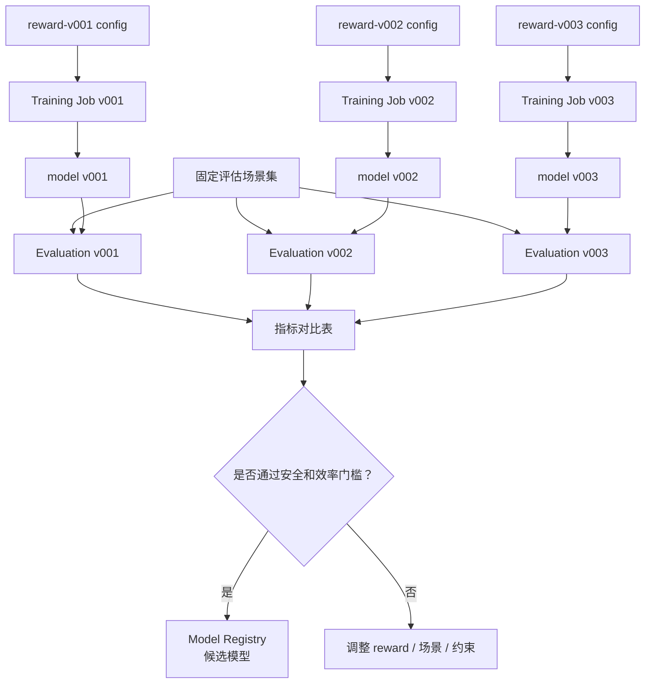

# 第 5 阶段：重点理解奖励函数

目标：理解自动驾驶 RL 里 reward 为什么关键、如何设计、如何调试、如何避免模型钻空子，以及如何在 AWS 训练流水线中管理 reward 版本和评估结果。

本阶段的核心结论：

> 奖励函数不是一个简单分数，而是把“我们希望车辆如何开”转成可优化信号。reward 写得好，agent 可能学到安全、平稳、高效的策略；reward 写得不好，agent 会学会钻空子，甚至表现得危险。

---

## 1. 奖励函数到底是什么

在监督学习里，模型通常学习：

```text
输入 -> 正确答案
```

例如：

```text
图像 -> 行人框
历史轨迹 -> 未来轨迹
```

但 RL 不一定有“正确动作标签”。它学习的是：

```text
状态 -> 动作 -> 环境变化 -> reward -> 策略更新
```

reward 的作用是告诉 agent：

```text
这个动作带来的结果好不好？
长期看是否值得？
```

自动驾驶里，reward 通常要表达多个目标：

- 安全
- 守规则
- 到达目标
- 效率
- 舒适
- 稳定
- 礼让
- 少制造风险

问题在于：这些目标经常互相冲突。

例如：

```text
开得快 -> 效率高，但风险可能更高
开得慢 -> 安全感强，但可能堵住交通
频繁变道 -> 可能更快，但不舒适且危险
永远不变道 -> 稳定，但可能无法完成任务
```

所以 reward 设计的本质是：

> 把安全、效率、舒适、规则这些价值取舍变成训练系统可以理解的反馈。

---

## 2. 一个最小高速公路 reward

以前面第 4 阶段的高速公路变道 agent 为例，一个最小 reward 可以写成：

```text
reward =
  speed_reward
  + lane_keeping_reward
  + goal_progress_reward
  - collision_penalty
  - unsafe_distance_penalty
  - lane_change_penalty
  - hard_brake_penalty
```

具体例子：

| 组件 | 含义 | 示例 |
| --- | --- | --- |
| `speed_reward` | 鼓励保持合理速度 | 速度越接近目标速度，奖励越高 |
| `lane_keeping_reward` | 鼓励稳定行驶 | 保持车道或在合理车道行驶 |
| `goal_progress_reward` | 鼓励向目标前进 | 每前进一段距离给奖励 |
| `collision_penalty` | 强烈惩罚碰撞 | 碰撞给很大负分 |
| `unsafe_distance_penalty` | 惩罚跟车太近 | 与前车距离过小时扣分 |
| `lane_change_penalty` | 惩罚不必要变道 | 每次变道有小成本 |
| `hard_brake_penalty` | 惩罚急刹 | 加速度变化太大时扣分 |

一个简单版本：

```text
reward =
  + 1.0 * speed_score
  + 0.5 * progress_score
  + 0.2 * right_lane_score
  - 100.0 * collision
  - 10.0 * unsafe_distance
  - 1.0 * lane_change
  - 5.0 * hard_brake
```

这里每个 component 都要单独记录。不要只记录总 reward。

原因是：

> 总 reward 只能告诉你“分数变高了”，component 才能告诉你“为什么变高”。

---

## 3. Reward 和业务指标不是一回事

这是非常重要的一点。

reward 是训练信号，业务指标是评估标准。

例如：

```text
训练时 reward 上升
```

不一定等于：

```text
碰撞率下降
到达率上升
乘坐更舒适
策略更可部署
```

所以要分清：

| 类型 | 用途 | 例子 |
| --- | --- | --- |
| Reward | 训练时优化 | speed_reward、collision_penalty |
| Metric | 训练后评估 | collision_rate、success_rate、comfort_score |
| Constraint | 不允许突破的边界 | 碰撞率必须低于阈值 |
| Gate | 是否进入下一阶段 | `collision_rate < 1%` 且 `success_rate > 95%` |

正确做法：

```text
训练用 reward
评估看 metrics
上线前过 gates
```

不要把 reward 当成唯一指标。

---

## 4. 自动驾驶常见 reward 组件

### 4.1 安全类

安全是最高优先级。

| Reward 组件 | 作用 |
| --- | --- |
| 碰撞惩罚 | 一旦碰撞给巨大负分 |
| 最小距离惩罚 | 跟车太近或侧向距离太近扣分 |
| Time-to-Collision 惩罚 | TTC 太小时扣分 |
| 风险区域惩罚 | 进入高风险区域扣分 |
| 预测碰撞惩罚 | 未来几秒可能碰撞也扣分 |

示例：

```text
if collision:
    reward -= 100

if time_to_collision < 2.0 seconds:
    reward -= 10
```

注意：

> 安全惩罚通常不能太弱，否则 agent 会学会为了速度冒险。

### 4.2 效率类

效率类 reward 鼓励车辆完成任务。

| Reward 组件 | 作用 |
| --- | --- |
| 速度奖励 | 接近目标速度给奖励 |
| 前进距离奖励 | 每向目标方向前进给奖励 |
| 到达目标奖励 | 成功到达终点给大奖励 |
| 超时惩罚 | 长时间不动或拖延扣分 |

示例：

```text
speed_score = current_speed / target_speed
reward += clip(speed_score, 0, 1)
```

风险：

> 速度奖励太强，agent 可能变得激进。

### 4.3 舒适类

舒适性不是装饰项。真实乘客会非常敏感。

| Reward 组件 | 作用 |
| --- | --- |
| 急刹惩罚 | 减少突然制动 |
| 急加速惩罚 | 减少突然加速 |
| jerk 惩罚 | 减少加速度剧烈变化 |
| 频繁变道惩罚 | 减少左右摇摆 |
| 横向加速度惩罚 | 减少转向过猛 |

示例：

```text
reward -= 0.1 * abs(acceleration)
reward -= 0.2 * abs(jerk)
```

### 4.4 规则类

规则类 reward 或 constraint 表达交通规则。

| 规则 | 处理方式 |
| --- | --- |
| 闯红灯 | 大惩罚或直接 episode failed |
| 超速 | 惩罚或硬约束 |
| 压实线 | 惩罚或禁止动作 |
| 逆行 | 大惩罚 |
| 不让行 | 惩罚 |

很多规则不应该只靠 reward 学。

更稳妥的是：

```text
规则约束层直接禁止危险或违法动作
reward 用来优化允许范围内的行为
```

### 4.5 任务完成类

任务完成 reward 告诉 agent 目标是什么。

| 组件 | 作用 |
| --- | --- |
| 到达目标 | 成功完成任务给大奖励 |
| 接近目标 | 向目标靠近给小奖励 |
| 偏离路线 | 离目标路线远则扣分 |
| 任务失败 | 碰撞、超时、越界则扣分 |

如果没有任务完成类 reward，agent 可能只学会“安全地不动”。

---

## 5. Reward 权重如何影响驾驶风格

reward 组件的权重会塑造 agent 的性格。

| 权重变化 | 可能学到的策略 |
| --- | --- |
| 速度权重大 | 开得快，可能激进 |
| 碰撞惩罚大 | 更谨慎，但可能保守 |
| 变道惩罚大 | 不爱变道，可能被慢车卡住 |
| 舒适惩罚大 | 平稳，但反应可能慢 |
| 进度奖励小 | 可能拖延或原地保守 |
| 安全距离惩罚小 | 跟车可能过近 |

可以把 reward 权重理解成驾驶策略的“价值观旋钮”。

一个小实验：

```text
Experiment A：速度权重 1.0，碰撞惩罚 -100
Experiment B：速度权重 2.0，碰撞惩罚 -100
Experiment C：速度权重 1.0，碰撞惩罚 -300
```

然后比较：

```text
average_speed
collision_rate
hard_brake_count
lane_change_count
success_rate
```

这比只看 average_reward 有意义得多。

---

## 6. Reward hacking：模型钻空子

reward hacking 指 agent 找到了“拿高分但不符合真实目标”的行为。

自动驾驶里的例子：

| Reward 设计 | Agent 可能钻的空子 |
| --- | --- |
| 碰撞惩罚很大，但没有进度奖励 | 原地不动最安全 |
| 速度奖励很高 | 危险超车、贴车行驶 |
| 变道惩罚太大 | 永远不变道，无法绕过慢车 |
| 只奖励右车道 | 一直向右靠，即使路线不需要 |
| 只惩罚实际碰撞 | 经常制造近碰撞但不撞上 |
| 到达目标奖励太大 | 为了到达目标违反舒适和礼让 |

解决思路：

- 同时看 reward components 和业务 metrics。
- 增加安全约束，而不是只靠惩罚。
- 用固定评估场景查行为。
- 用可视化回放看 agent 到底怎么开。
- 给长尾危险场景更高测试权重。
- 和 baseline 对比。

一句话：

> reward 不只要让模型“得分高”，还要让模型“行为对”。

---

## 7. Reward 应该分层设计

不要把所有目标都揉成一个神秘数字。建议分层：

```text
硬约束
  绝对不能做：碰撞、逆行、闯红灯、超出车辆能力

强惩罚
  非常不希望：TTC 太低、危险距离、急刹、压线

软目标
  希望更好：效率、舒适、少变道、路线贴合

任务奖励
  完成目标：到达终点、完成汇入、通过路口
```

对应到系统：

```text
安全层负责硬约束
reward 负责偏好优化
评估指标负责验收
```

这点非常重要：

> 安全不要完全交给 reward。reward 是训练信号，不是最后一道安全防线。

---

## 8. 一个更完整的高速公路 reward 示例

下面是学习用示例，不是生产公式。

```python
def compute_reward(state, action, next_state, info):
    reward_components = {}

    reward_components["progress"] = 0.5 * info["forward_progress"]

    speed_error = abs(next_state.ego_speed - info["target_speed"])
    reward_components["speed"] = max(0.0, 1.0 - speed_error / info["target_speed"])

    reward_components["collision"] = -100.0 if info["collision"] else 0.0

    reward_components["unsafe_distance"] = (
        -10.0 if info["front_distance"] < info["safe_distance"] else 0.0
    )

    reward_components["lane_change"] = -1.0 if action in ["left", "right"] else 0.0

    reward_components["hard_brake"] = (
        -5.0 if info["acceleration"] < -info["hard_brake_threshold"] else 0.0
    )

    reward_components["off_road"] = -50.0 if info["off_road"] else 0.0

    total_reward = sum(reward_components.values())
    return total_reward, reward_components
```

训练时应该记录：

```text
total_reward
reward_progress
reward_speed
reward_collision
reward_unsafe_distance
reward_lane_change
reward_hard_brake
reward_off_road
```

这样你才能知道：

```text
reward 上升是因为速度更快？
还是因为碰撞变少？
还是因为 agent 找到了奇怪漏洞？
```

---

## 9. Reward 版本管理

reward 一旦改变，就相当于训练目标改变了。

所以 reward 配置必须版本化。

示例：

```yaml
reward:
  version: reward-v001
  weights:
    speed: 1.0
    progress: 0.5
    collision: -100.0
    unsafe_distance: -10.0
    lane_change: -1.0
    hard_brake: -5.0
```

如果改成：

```yaml
reward:
  version: reward-v002
  weights:
    speed: 0.7
    progress: 0.5
    collision: -300.0
    unsafe_distance: -20.0
    lane_change: -1.0
    hard_brake: -8.0
```

就应该视为一个新的实验。

在 AWS 上要记录：

| 内容 | 保存位置 |
| --- | --- |
| reward 配置 | S3 config |
| 训练日志 | CloudWatch |
| checkpoint | S3 training output |
| reward components | S3 metrics 或 CloudWatch metrics |
| 评估报告 | S3 evaluation |
| 候选模型版本 | Model Registry |

核心原则：

> 没有 reward 版本，就无法解释模型行为为什么变了。

---

## 10. AWS 上如何做 reward 对比实验

一个推荐实验矩阵：

| 实验 | speed | collision | unsafe_distance | hard_brake | 目的 |
| --- | --- | --- | --- | --- | --- |
| reward-v001 | 1.0 | -100 | -10 | -5 | baseline |
| reward-v002 | 0.7 | -300 | -20 | -8 | 更保守 |
| reward-v003 | 1.2 | -300 | -20 | -8 | 安全约束下提高效率 |

AWS 流程：

```text
1. 为每个 reward 版本创建 config
2. 上传到 S3 configs/
3. 启动 SageMaker Training Job
4. 训练产物保存到 S3
5. 用同一批 evaluation scenarios 跑 Processing Job
6. 汇总 evaluation_report.json
7. 比较 collision_rate、success_rate、average_speed、comfort
8. 选择候选模型进入 Model Registry
```

对比实验图：



注意：

> reward 对比必须使用同一批评估场景，否则指标不可比。

---

## 11. Reward 调试流程

当训练结果不好时，不要盲目调算法。先检查 reward。

推荐流程：

```text
1. 看训练曲线
2. 看 reward components
3. 看业务 metrics
4. 看失败 episode 回放
5. 判断是 reward 问题、环境问题、动作空间问题，还是模型容量问题
6. 修改一个变量
7. 重新训练并对比
```

常见诊断：

| 现象 | 可能原因 |
| --- | --- |
| agent 不动 | 进度奖励太弱，安全惩罚太强 |
| agent 乱变道 | 变道成本太低，速度奖励太强 |
| agent 经常碰撞 | 碰撞惩罚太弱，危险距离没建模 |
| agent 太保守 | 碰撞惩罚过强，任务奖励不足 |
| reward 上升但碰撞率不降 | reward 和安全指标不一致 |
| 训练不稳定 | reward scale 太大或场景过难 |

每次只改一个主要因素，否则你不知道是什么导致结果变化。

---

## 12. Reward 和安全层的关系

真实系统中，reward 不是安全系统。

更合理的架构：

```text
RL policy
  -> 输出候选动作 / 候选轨迹
  -> 安全层检查
  -> 规则层检查
  -> 控制器执行
```

reward 负责：

```text
训练时塑造偏好
```

安全层负责：

```text
部署时阻止危险动作
```

例如：

```text
RL policy：建议左变道
预测模型：左后车正在高速接近
安全层：判断 TTC 过低，否决左变道
规划器：保持车道并减速
```

所以不要期待：

```text
碰撞惩罚足够大 -> 车一定不会撞
```

更正确是：

```text
碰撞惩罚帮助训练更安全的 policy
安全层负责部署时兜底
评估体系负责发现漏洞
```

---

## 13. 本阶段你需要掌握到什么程度

完成本阶段后，你应该能解释：

- reward 是 RL 的训练信号，不是业务验收指标。
- 自动驾驶 reward 通常包括安全、效率、舒适、规则、任务完成。
- reward 权重会塑造驾驶风格。
- reward hacking 是真实风险。
- 安全不要完全交给 reward，必须有安全层和规则约束。
- reward 配置必须版本化。
- AWS 上应该用不同 config 跑 reward 对比实验，并用同一批评估场景比较结果。
- 判断一个 policy 好不好，要看 `collision_rate`、`success_rate`、舒适性、效率和回放行为，而不是只看 average reward。

一句话总结：

> 奖励函数是训练目标的语言，但不是安全的全部。好的 reward 设计能引导 agent 学到更合理的驾驶策略；好的评估和安全层才能证明这个策略是否值得进入下一阶段。

---

## 14. 下一阶段预告

第 6 阶段会进入训练后的评估：

```text
为什么不能只看训练 reward
固定评估场景集是什么
自动驾驶评估指标有哪些
如何做 baseline 对比
gate 审批门槛如何设计
失败案例如何进入 regression suite
AWS 上如何用 Processing / Batch / EKS 跑评估流水线
```

核心问题会从“训练目标怎么定义”推进到“训练好的模型到底怎么判断能不能继续往下走”。
