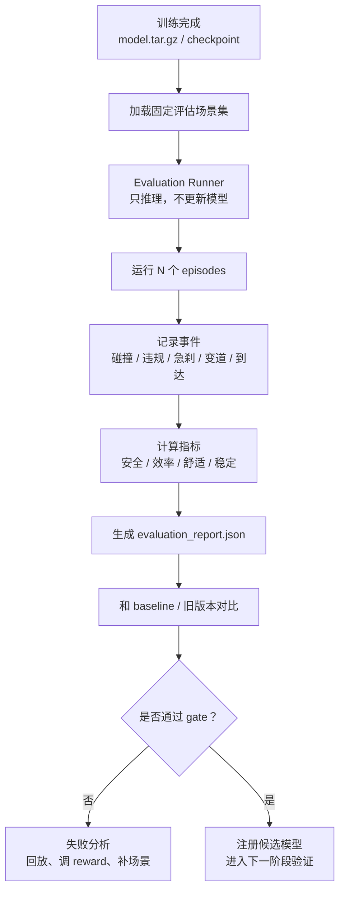
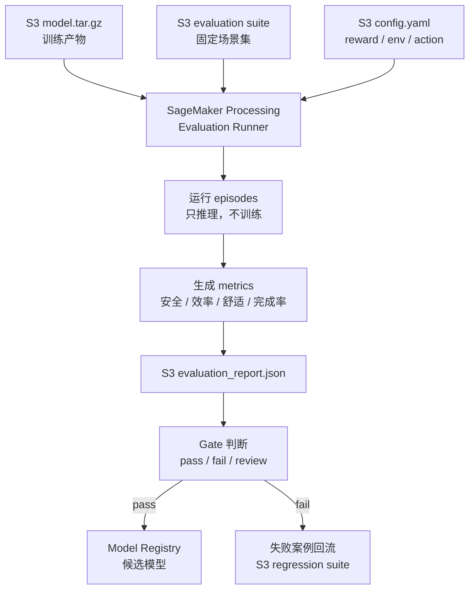

# 第 6 阶段：理解训练后的评估

目标：理解一个 RL policy 训练完成后，为什么不能只看训练 reward，必须通过固定场景、多指标、回归测试、失败分析和审批门槛来判断它是否值得进入下一阶段。

本阶段的核心结论：

> 训练回答“模型能不能学到策略”，评估回答“这个策略是否真的安全、稳定、可解释、可比较、值得继续验证”。自动驾驶里，评估比训练 reward 更接近真实工程决策。

---

## 1. 为什么训练后必须评估

训练结束时，通常你会得到：

```text
model checkpoint
training logs
average reward
训练过程曲线
```

但这些还不够。

原因是：

- 训练 reward 高，不代表碰撞率低。
- 模型可能只适应训练场景，不会泛化。
- 模型可能钻 reward 漏洞。
- 某些危险场景在训练中出现太少。
- 新模型可能修复一个问题，却引入另一个退化。
- 自动驾驶系统关心的是安全和稳定，不是单个分数。

所以训练后必须做：

```text
固定评估场景
多指标统计
baseline 对比
失败案例分析
长尾场景测试
回归测试
审批门槛判断
```

一句话：

> 评估不是训练的附属品，而是决定模型能不能进入下一阶段的门。

---

## 2. 训练指标和评估指标的区别

训练指标主要用于观察模型是否在学习。

评估指标用于判断模型是否可接受。

| 类型 | 用途 | 例子 |
| --- | --- | --- |
| 训练指标 | 看训练是否收敛 | episode reward、policy loss、value loss |
| 评估指标 | 看策略是否有效 | success rate、collision rate、violation rate |
| 安全门槛 | 决定是否通过 | collision rate 必须低于阈值 |
| 回归指标 | 看新模型是否退化 | 旧场景通过率不能下降 |
| 资源指标 | 看能否部署 | 延迟、CPU/GPU、内存 |

训练时你可能看：

```text
average_reward: 22.5
policy_loss: 0.03
value_loss: 0.18
```

评估时你更应该看：

```text
success_rate: 96%
collision_rate: 0.6%
unsafe_distance_rate: 3.2%
hard_brake_count: 18 / 100 episodes
average_speed: 27 m/s
```

训练指标告诉你：

```text
模型有没有变得更会拿分
```

评估指标告诉你：

```text
模型行为是否真的更好
```

---

## 3. 固定评估场景集

评估必须使用固定场景集，否则不同模型之间不可比。

错误做法：

```text
每次训练后随机生成一批不同场景
然后直接比较模型分数
```

这样可能只是场景难度不同。

正确做法：

```text
同一批 evaluation scenarios
同一套随机种子
同一套评估指标
同一套终止条件
不同模型版本横向比较
```

一个最小评估场景集可以分成：

| 场景类型 | 目的 |
| --- | --- |
| 正常低车流 | 检查基础驾驶能力 |
| 正常高车流 | 检查拥挤场景 |
| 前车慢行 | 检查跟车和变道 |
| 前车急刹 | 检查安全距离和制动 |
| 旁车快速接近 | 检查变道风险 |
| 左右车道都有车 | 检查保守性和决策 |
| 长时间无可变道机会 | 检查耐心和稳定 |

场景集应该版本化：

```text
eval-suite-v001
eval-suite-v002
eval-suite-regression-failures
eval-suite-corner-cases
```

在 S3 中可以这样组织：

```text
s3://bucket/autodriving-rl/evaluation-suites/
  eval-suite-v001/
    scenarios.yaml
    metadata.json
  regression-failures/
    scenarios.yaml
    metadata.json
```

---

## 4. 最小评估流程

训练后评估可以这样做：

```text
1. 加载训练好的 model checkpoint
2. 加载固定评估场景集
3. 禁止继续训练，只做推理
4. 跑 N 个 episodes
5. 记录每个 episode 的事件和轨迹
6. 计算多维指标
7. 生成 evaluation report
8. 和 baseline / 旧版本比较
9. 判断是否通过 gate
```

流程图：



---

## 5. 自动驾驶 RL 常见评估指标

### 5.1 安全指标

安全指标优先级最高。

| 指标 | 含义 |
| --- | --- |
| `collision_rate` | episode 中发生碰撞的比例 |
| `near_collision_rate` | 近碰撞比例 |
| `unsafe_distance_rate` | 跟车或侧向距离过近比例 |
| `min_ttc` | 最小 time-to-collision |
| `offroad_rate` | 离开道路或越界比例 |
| `rule_violation_rate` | 违反交通规则比例 |

安全指标一般是 gate：

```text
collision_rate <= 0.5%
unsafe_distance_rate <= 2%
rule_violation_rate <= 1%
```

对于真实自动驾驶，这些阈值会严很多；学习项目里可以先用较宽松阈值理解流程。

### 5.2 任务完成指标

| 指标 | 含义 |
| --- | --- |
| `success_rate` | 完成任务比例 |
| `route_completion` | 路线完成比例 |
| `timeout_rate` | 超时比例 |
| `stuck_rate` | 卡住不动比例 |

有些模型很安全，但根本不完成任务。比如一直慢慢开或原地保守。

所以必须同时看：

```text
安全 + 完成任务
```

### 5.3 效率指标

| 指标 | 含义 |
| --- | --- |
| `average_speed` | 平均速度 |
| `travel_time` | 完成任务耗时 |
| `progress_per_second` | 单位时间前进距离 |
| `traffic_flow_impact` | 是否明显影响后车 |

效率不能压过安全，但也不能完全忽略。

### 5.4 舒适指标

| 指标 | 含义 |
| --- | --- |
| `hard_brake_count` | 急刹次数 |
| `hard_accel_count` | 急加速次数 |
| `jerk_mean` | 平均 jerk |
| `jerk_max` | 最大 jerk |
| `lane_change_count` | 变道次数 |
| `lateral_accel_max` | 最大横向加速度 |

舒适性指标可以发现：

```text
模型没撞车，但开得很吓人
```

### 5.5 稳定性和泛化指标

| 指标 | 含义 |
| --- | --- |
| `seed_variance` | 不同随机种子下表现波动 |
| `scenario_pass_rate` | 各类场景通过率 |
| `weather_pass_rate` | 不同天气通过率 |
| `traffic_density_pass_rate` | 不同车流密度通过率 |
| `regression_pass_rate` | 历史失败场景修复情况 |

泛化指标很重要：

> 一个模型在平均场景表现好，不代表它在长尾场景可靠。

---

## 6. 评估报告应该长什么样

最小 `evaluation_report.json` 可以包含：

```json
{
  "experiment_name": "highway-ppo-v001",
  "model_artifact": "s3://bucket/.../model.tar.gz",
  "evaluation_suite": "eval-suite-v001",
  "episodes": 1000,
  "metrics": {
    "average_reward": 21.4,
    "success_rate": 0.96,
    "collision_rate": 0.006,
    "unsafe_distance_rate": 0.031,
    "average_speed": 27.2,
    "hard_brake_count": 18,
    "lane_change_count": 143
  },
  "gates": {
    "collision_rate": "pass",
    "success_rate": "pass",
    "unsafe_distance_rate": "fail"
  },
  "decision": "fail",
  "failure_reasons": [
    "unsafe_distance_rate exceeded threshold"
  ]
}
```

一个更完整的报告还应该包含：

- 模型版本
- reward 版本
- 训练配置
- 环境版本
- 场景集版本
- 评估代码版本
- 每类场景的分项指标
- top failure cases
- 和 baseline 的对比表

---

## 7. Baseline 对比

评估必须有对照组。

常见 baseline：

- 规则策略
- 不变道策略
- 旧版本模型
- 模仿学习模型
- 人类驾驶轨迹统计

对比表：

| 模型 | success_rate | collision_rate | unsafe_distance_rate | average_speed | hard_brake_count | 结论 |
| --- | --- | --- | --- | --- | --- | --- |
| Rule baseline | 0.92 | 0.003 | 0.010 | 23.0 | 8 | 安全但慢 |
| PPO v001 | 0.96 | 0.020 | 0.080 | 29.0 | 41 | 快但危险 |
| PPO v002 | 0.95 | 0.006 | 0.025 | 26.8 | 19 | 更平衡 |

这个表能帮助你判断：

```text
新模型到底是更好，还是只是 reward 更高？
```

---

## 8. Gate：是否通过的门槛

Gate 是模型进入下一阶段的条件。

示例：

```yaml
gates:
  min_success_rate: 0.95
  max_collision_rate: 0.005
  max_unsafe_distance_rate: 0.02
  max_hard_brake_count_per_100_episodes: 20
  min_regression_pass_rate: 0.98
```

Gate 的作用：

```text
把“感觉还不错”变成“是否满足明确标准”
```

评估决策可以是：

| 决策 | 含义 |
| --- | --- |
| pass | 可以进入下一阶段验证 |
| fail | 不能进入下一阶段，需要修复 |
| conditional pass | 部分通过，只能进入受限验证 |
| needs review | 指标接近阈值，需要人工审查 |

自动驾驶里，不建议让单一 average reward 决定 gate。

---

## 9. 失败案例分析

评估失败不可怕，最重要的是分析失败。

失败案例应该被保存和分类：

| 失败类型 | 可能原因 |
| --- | --- |
| 碰撞 | 安全距离 reward 不够，预测不足，动作太激进 |
| 急刹多 | policy 决策迟疑，控制不平滑 |
| 一直不变道 | 变道惩罚太高，速度奖励太弱 |
| 频繁变道 | 变道惩罚太低，速度奖励太强 |
| 任务失败 | progress reward 不够，场景太难 |
| 近碰撞多 | 只惩罚碰撞，没有惩罚 TTC |

失败分析流程：

```text
1. 找出失败 episode
2. 保存轨迹、动作、reward components、事件日志
3. 回放 episode
4. 标注失败原因
5. 加入 regression scenario set
6. 修改 reward / 场景 / policy / 安全层
7. 下次评估必须重新测试这些失败场景
```

这就是评估和数据闭环连接的地方。

---

## 10. 回归测试

回归测试的目的：

```text
防止新模型重新犯旧错误
```

每次发现失败案例，都应该加入回归场景集。

例如：

```text
regression-suite-v001:
  - front_vehicle_sudden_brake_001
  - left_lane_fast_rear_vehicle_003
  - dense_traffic_no_gap_007
```

新模型必须在这些场景上重新测试。

否则会出现：

```text
v002 修好了前车急刹
v003 又在同类场景失败
```

在 AWS 上：

```text
S3 保存 regression suite
Processing / Batch 每次评估都跑
evaluation_report 记录 regression_pass_rate
```

---

## 11. AWS 上的评估流水线

最小 AWS 评估流水线：



如果评估量很大：

| 规模 | 推荐方式 |
| --- | --- |
| 小规模 | SageMaker Processing |
| 大批量 episodes | AWS Batch |
| 多仿真器并行 | EKS |
| GPU / 3D 仿真 | EC2 GPU / EKS GPU nodes |

当前项目里的最小实现是：

```text
start_evaluation_processing_job.sh
  -> 启动 SageMaker Processing
  -> 读取 S3 model artifact
  -> 读取 S3 config
  -> 运行 evaluate.py
  -> 输出 evaluation_report.json
```

---

## 12. 当前最小项目的评估能力

当前 `code/training/evaluate.py` 已经增强为第 9 阶段 capstone project 的评估入口，可以输出：

```text
average_reward
min_reward
max_reward
average_episode_length
collision_rate
success_rate
unsafe_distance_rate
lane_change_count_per_episode
hard_brake_count_per_100_episodes
average_speed
per_episode_metrics
gate decision
failure_reasons
```

当前配置文件也已经加入：

```yaml
evaluation:
  suite_name: eval-suite-v001
  episodes: 20
  deterministic: true
  unsafe_distance_threshold: 8.0
  hard_brake_delta_threshold: 4.0
  gates:
    min_success_rate: 0.8
    max_collision_rate: 0.2
    max_unsafe_distance_rate: 0.25
    max_hard_brake_count_per_100_episodes: 100
```

这意味着最小项目已经可以练习：

```text
训练后评估
gate 判断
failure reason 记录
per-episode 分析
reward 对比实验
```

后续还可以继续增强：

```text
固定 evaluation suite 文件
top failure cases 导出
轨迹回放数据导出
reward components 逐项记录
多场景分类指标
regression suite 管理
```

这些增强会让最小训练项目进一步接近真实 MLOps 流程。

---

## 13. 本阶段你需要掌握到什么程度

完成本阶段后，你应该能解释：

- 训练 reward 不是评估结论。
- 评估必须使用固定场景集。
- 自动驾驶评估要看安全、完成率、效率、舒适、泛化和回归。
- Baseline 对比很重要。
- Gate 把模型审批从主观判断变成明确标准。
- 失败案例应该进入 regression suite，形成数据闭环。
- AWS 上可以用 SageMaker Processing、Batch、EKS、S3、Model Registry 构建评估流水线。

一句话总结：

> 训练后的评估，是把“模型看起来学会了”变成“模型在明确场景和指标下是否值得进入下一阶段”的过程。自动驾驶里，评估体系本身就是核心能力。

---

## 14. 下一阶段预告

第 7 阶段会进入仿真到现实的差距：

```text
什么是 sim-to-real gap
为什么仿真通过不等于可以上路
传感器、动力学、交通行为、地图和长尾场景的差距
domain randomization
system identification
真实日志回放
shadow mode
分阶段部署
AWS 如何支撑 sim-to-real 数据闭环
```

核心问题会从“训练后如何评估”推进到“仿真中验证过的模型，为什么到了真实世界还可能失败”。
