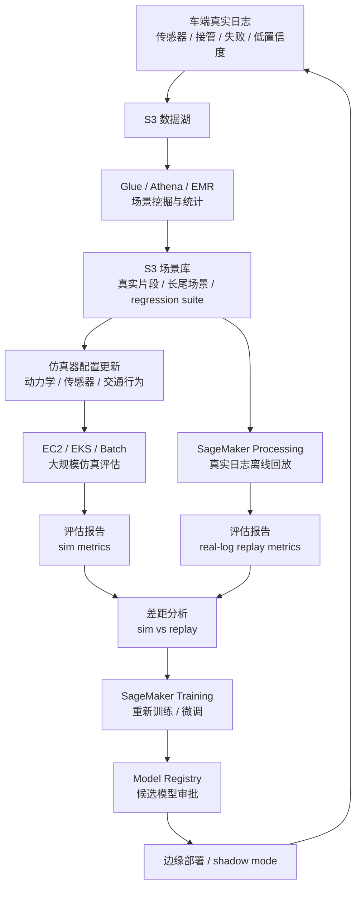

# 第 7 阶段：理解仿真到现实的差距

目标：理解为什么仿真中表现好的自动驾驶 policy，不能直接认为在真实道路上也可靠。你要看清楚 sim-to-real gap 的来源、风险、缓解方法，以及 AWS 工程闭环如何帮助持续缩小差距。

本阶段的核心结论：

> 仿真是必要的，但仿真不是现实。自动驾驶模型从仿真走向真实世界，最大挑战不是“把模型复制到车上”，而是证明模型在传感器噪声、车辆动力学、交通互动、长尾场景、硬件限制和安全约束下依然可靠。

---

## 1. 什么是 sim-to-real gap

`sim-to-real gap` 指：

```text
模型在仿真环境里的表现
和
模型在真实世界里的表现
之间的差距
```

例如：

```text
仿真里：
  agent 能安全变道，碰撞率很低

真实世界里：
  摄像头逆光，旁车行为更激进，定位有误差
  agent 可能判断晚、变道急、甚至产生危险动作
```

差距出现的根本原因是：

> 仿真环境只是现实世界的近似，而自动驾驶面对的是开放、复杂、不可完全建模的真实世界。

---

## 2. 为什么仿真通过不等于可以上路

仿真通过只能说明：

```text
模型在当前仿真器
当前场景集
当前传感器假设
当前交通行为模型
当前评估指标下表现达标
```

但真实道路还会引入：

- 传感器噪声
- 罕见天气
- 真实驾驶员行为
- 地图误差
- 施工和临时交通管制
- 硬件延迟
- 网络和日志系统异常
- 车况变化
- 法规和道路文化差异

所以更正确的流程是：

```text
仿真通过
  -> 离线真实日志回放
  -> 硬件在环测试
  -> shadow mode
  -> 封闭场地测试
  -> 小范围道路测试
  -> 持续监控和回流
```

仿真通过是进入下一阶段的条件，不是部署结论。

---

## 3. sim-to-real gap 的主要来源

### 3.1 传感器差距

仿真里的传感器通常太干净。

真实传感器会遇到：

| 真实问题 | 影响 |
| --- | --- |
| 摄像头逆光、眩光 | 红绿灯、车道线、行人识别变差 |
| 雨雪雾 | 视觉和 LiDAR 都可能退化 |
| 镜头脏污 | 局部遮挡或误检 |
| Radar 噪声 | 速度和距离估计波动 |
| LiDAR 反射异常 | 点云稀疏或错误 |
| 传感器时间不同步 | 融合结果错位 |
| GPS 漂移 | 定位偏差 |

如果仿真只给 agent 干净状态：

```text
front_vehicle_distance = 30m
left_lane_clear = true
```

真实系统可能面对的是：

```text
前车检测置信度低
左后车被遮挡
Radar 速度估计跳变
车道线半遮挡
```

这会让下游预测、规划和 RL policy 都受影响。

### 3.2 车辆动力学差距

仿真里的车通常很听话。

真实车辆会受到：

- 轮胎磨损
- 路面湿滑
- 坡度
- 载重
- 制动响应延迟
- 转向系统延迟
- 车辆控制器限制
- 低温或高温影响

仿真中一个动作可能是：

```text
decelerate
```

真实世界里要变成：

```text
制动请求
制动系统响应
轮胎和路面产生摩擦
车身姿态变化
车辆真实减速
```

如果仿真动力学过于理想，policy 可能学到现实中不可执行或不舒适的动作。

### 3.3 交通参与者行为差距

真实司机和行人不完全按规则行动。

仿真交通模型可能是：

```text
前车保持速度
旁车按固定概率变道
行人按固定轨迹穿过
```

真实世界可能是：

```text
旁车突然抢道
前车犹豫后急刹
行人走到一半停下
骑行者逆行
司机用眼神或车速进行博弈
```

自动驾驶里最难的部分之一是交互：

> 你做的动作会影响别人，别人也会根据你的动作反应。

简单仿真很难完全覆盖这种社会性互动。

### 3.4 地图和道路结构差距

仿真地图通常是稳定和正确的。

真实道路会有：

- 施工改道
- 临时车道线
- 褪色车道线
- 地图过期
- 道路标志被遮挡
- 路口拓扑复杂
- 非标准道路设计

如果 policy 过度依赖完美地图，真实道路中就容易出错。

### 3.5 长尾场景差距

长尾场景是少见但重要的场景。

例如：

- 货车掉落物
- 救护车从后方接近
- 路边车辆突然开门
- 动物或儿童突然出现
- 施工人员手势指挥
- 交通灯故障
- 事故现场绕行

仿真可以制造长尾场景，但问题是：

```text
我们很难事先知道所有长尾场景是什么
```

这就是为什么需要真实道路日志回流和场景挖掘。

### 3.6 计算和部署差距

训练和仿真时，模型可能在云上资源充足。

车端部署时，会面对：

- CPU/GPU/NPU 资源限制
- 实时延迟要求
- 内存限制
- 热管理
- 多模型并行
- 进程重启
- 传感器数据吞吐
- 系统负载波动

一个 policy 在云上推理很快，不代表在车端完整系统里也稳定。

所以 sim-to-real gap 不只是“仿真和现实的物理差距”，也包括：

```text
训练环境
评估环境
部署运行时
真实车端硬件
之间的差距
```

---

## 4. sim-to-real gap 的典型风险

| 风险 | 例子 |
| --- | --- |
| 过拟合仿真器 | 模型只适应某个 simulator 的规则 |
| 过拟合场景集 | 在 eval-suite-v001 表现好，换场景失败 |
| 过度依赖干净观测 | 遇到噪声和遮挡就退化 |
| 学到不可执行动作 | 现实车辆无法平稳执行 |
| 对其他车反应过于理想化 | 真实司机不按仿真行为行动 |
| 安全边界不足 | 仿真没撞，现实中接近危险 |
| 延迟被忽略 | 真实系统反应慢半秒就可能出事 |

一句话：

> 仿真中没有暴露的问题，可能会在真实世界用更昂贵的方式暴露出来。

---

## 5. 缓解方法一：Domain Randomization

`Domain randomization` 的思想是：

```text
不要让模型只适应一个干净、固定的仿真世界
而是训练时随机化环境，让模型学会鲁棒性
```

可以随机化：

| 随机化对象 | 示例 |
| --- | --- |
| 传感器 | 噪声、延迟、遮挡、缺帧 |
| 视觉 | 光照、天气、颜色、纹理 |
| 车辆动力学 | 制动能力、转向响应、摩擦系数 |
| 交通行为 | 其他车速度、变道概率、急刹概率 |
| 地图 | 车道宽度、曲率、路口结构 |
| 初始条件 | 自车速度、车道、周围车辆位置 |

训练目标：

> 让 policy 不依赖某个精确仿真细节，而是在多种变化下都能保持合理行为。

但要注意：

```text
随机化太弱 -> 没有效果
随机化太强 -> 场景不真实，训练困难
```

---

## 6. 缓解方法二：System Identification

`System identification` 是用真实数据校准仿真器。

例如：

```text
真实车辆在某速度下刹车
实际减速度曲线是什么？
转向响应延迟是多少？
湿滑路面下制动距离是多少？
```

然后把这些数据用于调整仿真：

```text
车辆动力学模型
轮胎摩擦参数
制动响应时间
转向系统延迟
传感器噪声分布
```

目标是：

> 让仿真不只是看起来像真实，而是在关键物理和传感器行为上更接近真实。

AWS 上可以：

```text
S3 存真实车辆日志
Glue / Athena 分析响应曲线
SageMaker Processing 估计参数
仿真配置写回 S3 scenario/simulator configs
```

---

## 7. 缓解方法三：真实日志回放

真实日志回放是连接仿真和现实的重要桥梁。

流程：

```text
真实道路日志
  -> 离线喂给新模型
  -> 观察模型输出
  -> 和旧模型、人类行为、安全规则对比
```

它可以发现：

- 感知在真实数据上是否退化
- policy 是否在真实场景中提出危险动作
- 新模型和旧模型分歧在哪里
- 哪些真实场景需要加入仿真场景库

限制是：

> 回放不能完全评估反事实。如果新模型当时选择了另一个动作，其他车会如何反应，日志本身无法直接告诉你。

所以：

```text
真实日志回放
和
可交互仿真
必须结合
```

---

## 8. 缓解方法四：Residual Reality Gap 评估

即使做了随机化和校准，仍然会有剩余差距。

所以要专门评估：

```text
模型在哪些真实场景中比仿真表现差？
哪些仿真场景没有覆盖真实失败？
哪些评估指标在仿真和真实之间不一致？
```

可以建立对照表：

| 场景类型 | 仿真通过率 | 真实回放通过率 | 差距 |
| --- | --- | --- | --- |
| 高速跟车 | 99% | 97% | 小 |
| 旁车强行并线 | 96% | 88% | 大 |
| 夜间车道线 | 98% | 82% | 大 |
| 雨天低速 | 95% | 85% | 中 |

差距大的场景就是下一轮重点：

```text
补真实数据
改仿真器
增加 domain randomization
加强 safety layer
加入 regression suite
```

---

## 9. 缓解方法五：Shadow Mode

`shadow mode` 指：

```text
新模型在真实车端运行
但不控制车辆
只记录它会做什么
```

例如：

```text
旧系统 / 人类司机实际控制车辆
新 RL policy 在后台接收同样输入
它输出：我会左变道
系统记录：此时真实司机选择保持车道
安全规则判断：左变道风险过高
```

shadow mode 可以发现：

- 新模型在真实数据流中是否稳定
- 推理延迟是否满足要求
- 输出是否经常和安全层冲突
- 和人类或旧系统分歧最大的场景在哪里
- 是否存在高风险动作倾向

shadow mode 是从仿真走向真实部署的重要过渡阶段。

---

## 10. 缓解方法六：分阶段部署

不要从仿真直接全量上路。

更现实的阶段：

```text
仿真
  -> 离线真实日志回放
  -> 硬件在环
  -> shadow mode
  -> 封闭场地
  -> 低速园区
  -> 固定路线
  -> 限定区域
  -> 更大范围
```

每一阶段都有 gate：

```text
通过上一阶段
才能进入下一阶段
```

并且部署范围要受限：

- 限定城市
- 限定天气
- 限定时段
- 限定道路类型
- 限定速度
- 人类安全员
- 可快速回滚

---

## 11. AWS 如何支撑 sim-to-real 闭环

AWS 的角色不是消除 sim-to-real gap，而是支撑闭环：

```text
真实数据进入云端
  -> 数据处理和场景挖掘
  -> 更新仿真场景库
  -> 训练或评估新模型
  -> 大规模仿真和回放测试
  -> 模型注册和审批
  -> 受控部署
  -> 真实运行日志回流
```

参考架构：



关键点：

| AWS 能力 | 对应作用 |
| --- | --- |
| S3 | 存真实日志、仿真场景、模型、报告 |
| Glue / Athena / EMR | 挖掘真实场景和失败案例 |
| SageMaker Processing | 离线回放、参数估计、评估报告 |
| EC2 / EKS / Batch | 大规模仿真 |
| SageMaker Training | 训练和微调模型 |
| Model Registry | 版本管理、审批和审计 |
| IoT / Kinesis / Greengrass | 车端日志回流、组件更新和 shadow mode 管理 |
| CloudWatch | 运行日志和监控 |

---

## 12. 对当前最小项目的 sim-to-real 意义

当前项目是：

```text
highway-env + PPO + SageMaker Training + Processing Evaluation
```

它还不涉及真实世界，所以它的 sim-to-real gap 非常大。

它能帮助你理解：

- RL 训练流程
- reward 设计
- 评估报告
- AWS 训练闭环
- 模型注册

但它不能证明：

- 真实车能开
- 真实感知可靠
- 真实交通互动可靠
- 真实车辆能执行动作
- policy 能处理长尾场景

下一步可以逐渐加入：

| 升级方向 | 作用 |
| --- | --- |
| 固定 evaluation suite | 让评估可比较 |
| domain randomization | 让策略不只适应单一仿真 |
| 更丰富场景 | 拓展交通密度和交互 |
| MetaDrive / CARLA | 更复杂仿真 |
| 真实轨迹数据 | 做回放或预测模型 |
| failure case logging | 建 regression suite |
| gate decision | 更接近模型审批 |

---

## 13. 如何判断 sim-to-real 风险是否降低

不能只问：

```text
仿真分数是不是更高？
```

更应该问：

```text
真实日志回放表现是否变好？
仿真失败案例是否减少？
真实失败案例是否被加入场景库？
仿真和真实指标差距是否缩小？
模型是否在噪声、延迟、遮挡下稳定？
硬件上延迟是否满足要求？
安全层是否能拦住高风险动作？
```

可以建立一个 sim-to-real 风险表：

| 风险项 | 当前状态 | 下一步 |
| --- | --- | --- |
| 传感器噪声 | 仿真未建模 | 加入 observation noise |
| 车辆动力学 | 简化模型 | 用真实响应数据校准 |
| 交通行为 | 简单规则车 | 增加 aggressive drivers |
| 长尾场景 | 覆盖少 | 建 regression suite |
| 硬件延迟 | 未测试 | 做硬件在环 |
| 安全兜底 | 未集成 | 加 safety layer |

---

## 14. 本阶段你需要掌握到什么程度

完成本阶段后，你应该能解释：

- sim-to-real gap 是仿真表现和真实表现之间的差距。
- 差距来自传感器、动力学、交通行为、地图、长尾场景和部署硬件。
- 仿真通过不是可以上路，只是进入下一验证阶段。
- domain randomization 可以提高鲁棒性，但不能彻底解决问题。
- system identification 可以用真实数据校准仿真。
- 真实日志回放和可交互仿真互补。
- shadow mode 是从仿真到真实部署的重要过渡。
- AWS 的价值是支撑真实数据回流、场景挖掘、仿真更新、训练评估和模型审批闭环。

一句话总结：

> sim-to-real gap 的本质，是模型在“被设计出来的世界”中学到的行为，进入“真实且不完全可控的世界”时会失效。工程上不能假装这个差距不存在，而要用数据闭环、仿真校准、真实回放、shadow mode 和分阶段部署不断缩小它。

---

## 15. 下一阶段预告

第 8 阶段会进入真实部署流程：

```text
候选模型如何进入 Model Registry
模型 artifact 如何打包
车端运行时和编排如何理解
部署前系统集成测试
硬件在环测试
shadow mode
封闭场地和小范围道路测试
灰度发布和回滚
部署后监控和数据回流
AWS 上的真实部署参考架构
```

核心问题会从“仿真和现实为什么有差距”推进到“一个候选模型如何受控地进入真实部署链路”。
