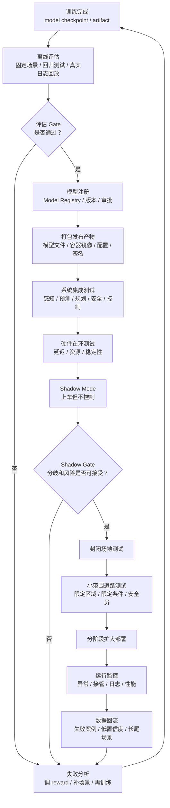
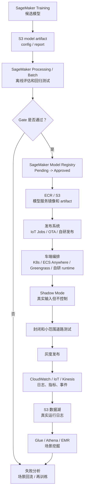

# 第 8 阶段：理解真实部署流程

目标：理解自动驾驶模型从“训练完成”到“真实车端运行”之间还要经过哪些工程步骤。重点不是把模型文件复制到车上，而是理解模型审批、打包、集成、边缘部署、shadow mode、分阶段道路测试、监控、回滚和数据回流。

本阶段的核心结论：

> 自动驾驶部署不是一个按钮，而是一条受控发布链路。训练好的模型只是候选产物，必须经过模型治理、系统集成、安全验证、车端运行时部署、受限测试、监控回流和快速回滚，才可能逐步扩大使用范围。

---

## 1. 真实部署不是“把模型上车”

很多人会以为部署流程是：

```text
训练模型
  -> 上传到车
  -> 车辆自动驾驶
```

真实流程更接近：

```text
候选模型
  -> 离线评估
  -> 模型审批
  -> 打包成可部署 artifact
  -> 集成到车端运行时
  -> 硬件在环测试
  -> shadow mode
  -> 封闭场地测试
  -> 小范围道路测试
  -> 分阶段扩大
  -> 监控和回滚
  -> 数据回流再训练
```

也就是说：

> 训练产物不是部署结论，而是部署流程的输入。

---

## 2. 真实部署总流程图



---

## 3. 部署前的模型治理

模型治理回答：

```text
这个模型是什么？
谁训练的？
用什么数据和配置训练的？
通过了哪些评估？
谁批准进入下一阶段？
出了问题能不能追溯和回滚？
```

一个候选模型至少要记录：

| 信息 | 例子 |
| --- | --- |
| 模型版本 | `highway-ppo-v001` |
| 训练任务 | SageMaker Training Job name |
| 模型 artifact | `s3://.../model.tar.gz` |
| 训练配置 | `config.yaml` |
| reward 版本 | `reward-v001` |
| 场景集版本 | `eval-suite-v001` |
| 评估报告 | `evaluation_report.json` |
| 审批状态 | `PendingManualApproval` / `Approved` / `Rejected` |
| 风险说明 | 已知失败场景、适用边界 |

AWS 对应：

```text
S3：保存 artifact、配置、报告
SageMaker Model Registry：注册候选模型和审批状态
CloudTrail：记录谁做了审批或发布操作
IAM：限制谁可以批准和发布
```

关键思想：

> 没有版本、配置、评估和审批记录的模型，不应该进入部署链路。

---

## 4. 部署产物不只是模型文件

真实部署通常不是只有一个 `model.zip`。

部署包可能包含：

```text
模型权重
模型结构
推理代码
预处理代码
后处理代码
运行配置
安全阈值
特征 schema
依赖版本
容器镜像
签名和校验信息
回滚版本信息
```

对于自动驾驶系统，还要明确接口：

```text
输入是什么？
输出是什么？
频率是多少？
延迟预算是多少？
异常时如何降级？
安全层如何读取输出？
```

例如一个规划 / RL policy 服务可能声明：

```text
input:
  ego_state
  lane_graph
  tracked_objects
  predicted_trajectories
  route_command

output:
  candidate_action
  confidence
  optional_target_trajectory
  debug_info

latency_budget:
  p95 < 50 ms
```

部署前必须保证上下游都理解这份接口。

---

## 5. 车端运行时和编排

第 1 阶段我们已经提过：复杂自动驾驶系统不是 Greengrass 单独管理所有模型。

车端通常有多层：

| 层 | 作用 |
| --- | --- |
| 车载中间件 | 实时消息通信、传感器数据流、进程协作 |
| 容器 / 进程编排 | 启停服务、健康检查、资源限制、版本切换 |
| 模型服务 | 感知、预测、规划、控制、安全、日志 |
| 设备管理 | 配置下发、组件更新、日志回传 |
| 安全监控 | 异常检测、降级、接管、回滚 |

可能用到：

- ROS 2 / DDS
- AUTOSAR Adaptive
- 自研车载 runtime
- Kubernetes / K3s / EKS Anywhere
- ECS Anywhere
- AWS IoT Greengrass / IoT Jobs

分工可以这样理解：

```text
Kubernetes / ECS 级工具：管理多个容器和服务
车载中间件：管理低延迟数据流
Greengrass / IoT Jobs：设备管理、组件更新、日志回传
```

---

## 6. 部署前系统集成测试

模型单独通过评估，不代表系统集成后安全。

集成测试要检查：

| 测试项 | 问题 |
| --- | --- |
| 输入输出 schema | 上游输出是否符合模型输入 |
| 时间同步 | 感知、预测、定位时间戳是否一致 |
| 延迟 | 模型输出是否赶得上控制周期 |
| 异常输入 | 缺帧、空目标、低置信度时怎么处理 |
| 安全层接口 | 安全层能否否决危险动作 |
| 降级逻辑 | 模型失败时是否切回规则策略 |
| 资源竞争 | 多模型同时运行是否超 CPU/GPU/内存 |

典型失败：

```text
模型离线评估很好
但车端集成后因为输入时间戳错位
预测对象位置滞后 200ms
规划做出错误判断
```

所以集成测试是部署前的必要关卡。

---

## 7. 硬件在环测试

硬件在环测试关注：

```text
模型在目标车载硬件上是否能稳定运行？
```

要测：

- p50 / p95 / p99 推理延迟
- CPU / GPU / NPU 利用率
- 内存占用
- 温度和功耗
- 长时间运行稳定性
- 进程崩溃后恢复
- 输入高峰时是否丢帧
- 和其他模型并行时是否互相影响

云上训练的模型很可能在云上运行良好，但车端硬件更受限。

所以部署前要确认：

```text
功能正确
实时达标
资源可控
异常可恢复
```

---

## 8. Shadow Mode

Shadow mode 是非常关键的真实部署前阶段。

定义：

```text
新模型在真实车端运行
但不控制车辆
只记录它会做什么
```

流程：

```text
真实车辆行驶
旧系统或人类司机控制
新模型接收同样输入
新模型输出候选动作
系统记录候选动作、置信度、风险、与旧系统分歧
```

Shadow mode 关注：

| 指标 | 含义 |
| --- | --- |
| disagreement rate | 新模型和旧系统 / 人类行为分歧比例 |
| unsafe proposal rate | 新模型提出危险动作比例 |
| safety rejection rate | 安全层否决新模型输出比例 |
| latency | 真实车端推理延迟 |
| crash / restart | 模型服务稳定性 |
| low-confidence rate | 低置信度场景比例 |

Shadow mode 的价值：

> 在不控制车辆的情况下，用真实世界数据观察新模型行为。

但它仍然不能完全证明模型可控，因为新模型没有真的改变世界，其他交通参与者也没有对它的动作做出反应。

---

## 9. 封闭场地和小范围道路测试

Shadow mode 通过后，也不能直接大范围发布。

下一步通常是：

```text
封闭场地
  -> 低速园区
  -> 固定路线
  -> 限定区域道路
  -> 扩大 ODD
```

ODD 是 Operational Design Domain，表示系统被允许运行的设计范围。

ODD 可以限制：

- 城市或区域
- 道路类型
- 天气
- 时段
- 速度
- 交通密度
- 是否允许无保护左转
- 是否允许施工区域

例如：

```text
ODD v001:
  区域：封闭园区
  速度：<= 25 km/h
  天气：晴天或小雨
  时间：白天
  道路：已建图道路
  人类安全员：必须
```

部署不是全有或全无，而是逐步扩大 ODD。

---

## 10. 灰度发布和回滚

真实部署必须能灰度和回滚。

灰度发布：

```text
先给少量车辆
限定路线
限定功能
观察指标
再逐步扩大
```

回滚：

```text
如果指标异常
快速切回上一个稳定版本
```

需要记录：

| 内容 | 作用 |
| --- | --- |
| 当前运行模型版本 | 出问题时知道是谁 |
| 上一个稳定版本 | 支持回滚 |
| 配置版本 | 防止模型和配置不匹配 |
| 发布批次 | 知道哪些车辆受影响 |
| 指标阈值 | 自动或人工触发回滚 |

可能触发回滚的信号：

- 接管率上升
- 安全层否决率上升
- 规划失败率上升
- 延迟超过阈值
- 进程崩溃率上升
- 低置信度场景异常增加

---

## 11. 部署后的监控

部署后要持续监控，不是发布完就结束。

监控分几类：

### 11.1 行为安全指标

- 接管率
- 急刹次数
- 近碰撞事件
- 安全层否决次数
- 违规事件
- 规划失败

### 11.2 模型质量指标

- 低置信度比例
- 输入分布漂移
- 输出分布变化
- 和旧模型分歧
- 场景类型覆盖

### 11.3 系统运行指标

- 延迟
- CPU/GPU/NPU
- 内存
- 进程重启
- 容器健康
- 日志上传成功率

### 11.4 数据闭环指标

- 新失败案例数量
- 已标注场景数量
- regression suite 增长
- 新场景回流训练周期

监控的目的：

> 发现真实世界中训练和仿真没有覆盖的问题。

---

## 12. 数据回流和持续迭代

真实部署最重要的能力之一是数据闭环。

回流数据包括：

- 人类接管
- 安全层否决
- 急刹急转
- 近碰撞
- 低置信度
- 模型和旧系统分歧
- 传感器异常
- 新道路结构
- 罕见天气

闭环流程：

```text
车端日志
  -> 上传云端
  -> 场景挖掘
  -> 人工或自动标注
  -> 加入场景库 / regression suite
  -> 重新训练或评估
  -> 新模型审批
  -> 分阶段部署
```

数据回流让系统从真实世界中持续学习，但注意：

> 车端日志回流不是实时修改模型参数，而是进入下一轮离线训练、评估和审批流程。

---

## 13. AWS 上的真实部署参考架构



AWS 服务责任边界：

| 服务 | 作用 |
| --- | --- |
| SageMaker Training | 训练候选模型 |
| SageMaker Processing / Batch | 离线评估、回归测试、报告生成 |
| S3 | 保存模型、配置、报告、运行日志、场景库 |
| Model Registry | 模型版本和审批状态 |
| ECR | 保存模型服务镜像 |
| IoT Jobs / Greengrass | 组件更新、设备管理、日志回传 |
| EKS Anywhere / ECS Anywhere | 管理复杂边缘容器工作负载 |
| Kinesis | 流式回传事件和日志 |
| CloudWatch | 运行监控、日志和告警 |
| Glue / Athena / EMR | 场景挖掘、日志分析 |
| IAM / CloudTrail | 权限、审批和审计 |

---

## 14. 当前最小项目离真实部署还差什么

当前项目已经有：

```text
训练代码
评估代码
S3 / ECR / SageMaker Training
SageMaker Processing
Model Registry 候选模型注册
```

但它还缺：

| 缺口 | 说明 |
| --- | --- |
| 真实车端 runtime | 现在没有车端推理服务 |
| 模型服务 API | 没有定义在线 inference 输入输出 |
| 安全层 | 没有部署时否决危险动作 |
| 车端编排 | 没有 K8s/ECS/Greengrass 运行模型服务 |
| Shadow mode | 没有真实车端后台运行 |
| OTA / 发布系统 | 没有实际设备更新机制 |
| 运行监控 | 没有线上接管、延迟、健康指标 |
| 回滚机制 | 没有稳定版本切换 |
| 真实数据回流 | 目前没有真实车辆日志 |

所以当前项目适合学习：

```text
云上训练和评估闭环
```

还不等于：

```text
真实自动驾驶部署系统
```

---

## 15. 部署决策检查清单

一个候选模型进入下一阶段前，可以问：

```text
模型版本是否清楚？
训练配置是否保存？
reward 版本是否保存？
评估场景集是否固定？
是否通过安全 gate？
是否通过 regression suite？
是否有 baseline 对比？
已知失败场景是否记录？
接口 schema 是否稳定？
车端延迟是否达标？
安全层能否兜底？
是否支持灰度？
是否支持回滚？
是否有监控和告警？
日志是否能回流？
谁批准发布？
```

如果这些问题回答不上来，就不应该进入真实部署。

---

## 16. 本阶段你需要掌握到什么程度

完成本阶段后，你应该能解释：

- 真实部署不是把模型文件放到车上。
- 候选模型必须经过评估、审批、打包、集成、硬件测试、shadow mode 和分阶段道路测试。
- 部署 artifact 包含模型、代码、配置、schema、依赖和安全信息。
- 车端运行时需要容器编排、车载中间件、设备管理和安全监控协同。
- Shadow mode 是真实部署前的重要阶段，但仍不能替代可控道路测试。
- 真实部署必须有灰度、回滚、监控和数据回流。
- AWS 可以支撑训练、评估、模型注册、发布管理、日志回流和场景挖掘。

一句话总结：

> 自动驾驶真实部署的核心不是“模型能运行”，而是“模型在明确边界内、可监控、可回滚、可审计、可持续改进地运行”。部署流程本身就是安全系统的一部分。

---

## 17. 下一阶段预告

第 9 阶段会做一个小项目把前面内容串起来：

```text
highway-env 高速公路变道任务
PPO 训练
AWS IaC
SageMaker Training
SageMaker Processing 评估
reward 对比实验
Model Registry 候选模型
sim-to-real 风险记录
项目总结报告
```

核心问题会从“真实部署流程是什么”推进到“如何用一个小项目完整走一遍训练、评估、注册和风险判断”。
