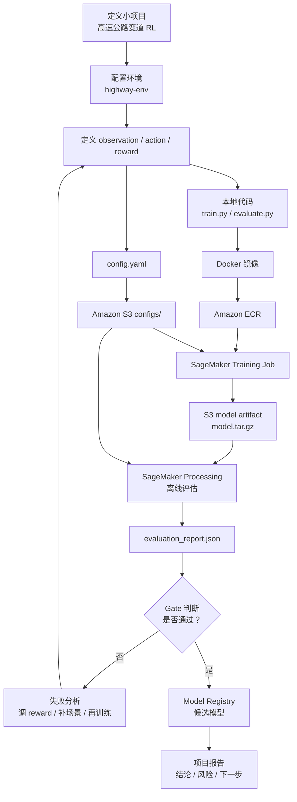

# 第 9 阶段：做一个小项目来串起来

目标：用一个小项目把前 1-8 阶段串起来。这个项目不追求真实自动驾驶能力，而是完整走一遍“定义任务 -> 仿真训练 -> reward 设计 -> AWS 云上训练 -> 评估 -> 模型注册 -> sim-to-real 风险记录 -> 部署决策报告”的流程。

项目名称：

```text
Highway Lane-Change RL on AWS
```

一句话描述：

> 在 `highway-env` 中训练一个高速公路变道 RL agent，用 AWS 跑通训练、评估、模型注册和实验报告，最终产出一个“候选策略是否值得进入下一阶段”的决策文档。

---

## 1. 项目总目标

这个小项目要验证的不是：

```text
我们训练出了真正可上车的自动驾驶模型
```

而是：

```text
我们理解并跑通了一个自动驾驶 RL 训练与评估闭环
```

完整闭环包括：

```text
任务定义
  -> 仿真环境
  -> observation / action / reward
  -> 训练配置
  -> AWS 基础设施
  -> SageMaker Training
  -> SageMaker Processing 评估
  -> evaluation report
  -> Model Registry 候选模型
  -> sim-to-real 风险说明
  -> 部署决策报告
```

---

## 2. 最终交付物

完成第 9 阶段后，应该有这些产物：

| 交付物 | 位置 | 作用 |
| --- | --- | --- |
| 项目代码 | `code/` | 最小 AWS 训练和评估代码 |
| 训练配置 | `code/configs/` | 定义环境、reward、训练参数 |
| IaC | `code/infra/cloudformation/` | 创建 S3、ECR、SageMaker role |
| AWS 脚本 | `code/infra/scripts/` | 部署、上传、训练、评估、注册 |
| 训练产物 | S3 | `model.tar.gz`、checkpoint、配置 |
| 评估报告 | S3 / local outputs | `evaluation_report.json` |
| 模型注册记录 | SageMaker Model Registry | 候选模型版本 |
| 项目总结报告 | `docs/stage-09-project-report-template.md` | 解释实验结果和是否通过 |
| 风险记录 | 报告内 | sim-to-real 风险和下一步 |

---

## 3. 代码目录与实际构建说明

第 9 阶段会使用统一代码目录：

```text
autodriving-rl/
  docs/
    stage-09-capstone-project-plan.md
  code/
    README.md
    configs/
      highway-ppo-v001.yaml
      highway-ppo-conservative.yaml
      highway-ppo-speedy.yaml
    training/
      train.py
      evaluate.py
      requirements.txt
      Dockerfile
    infra/
      cloudformation/
        foundation.yaml
      scripts/
        deploy_foundation.sh
        upload_config.sh
        build_push_ecr.sh
        start_training_job.sh
        wait_training_job.sh
        start_evaluation_processing_job.sh
        wait_processing_job.sh
        download_evaluation_report.sh
        register_model_package.sh
    tools/
      summarize_evaluations.py
```

这套代码原本来自第 4 阶段的最小训练流程实践，现在作为第 9 阶段 capstone project 的实际项目代码。

它的目标是跑通：

```text
本地代码
  -> Docker 镜像
  -> Amazon ECR
  -> SageMaker Training Job
  -> S3 保存 model.tar.gz
  -> SageMaker Processing Job 评估
  -> S3 保存 evaluation_report.json
  -> SageMaker Model Registry 注册候选模型
```

各部分职责：

| 目录 / 文件 | 作用 |
| --- | --- |
| `code/configs/highway-ppo-v001.yaml` | 定义环境、reward、训练参数、评估参数 |
| `code/configs/highway-ppo-conservative.yaml` | 更保守的 reward 对比实验 |
| `code/configs/highway-ppo-speedy.yaml` | 更追求速度的 reward 对比实验 |
| `code/training/train.py` | 读取配置，创建 `highway-env`，训练 PPO，保存模型 |
| `code/training/evaluate.py` | 加载训练产物，运行 evaluation episodes，输出评估报告 |
| `code/training/Dockerfile` | 构建 SageMaker Training / Processing 共用镜像 |
| `code/infra/cloudformation/foundation.yaml` | 创建 S3、ECR、SageMaker execution role |
| `code/infra/scripts/*.sh` | 部署、上传配置、构建镜像、启动训练、评估、注册模型 |
| `code/tools/summarize_evaluations.py` | 汇总多个评估报告，生成 CSV 和 Markdown 表 |

实际运行时，从代码目录进入：

```bash
cd /Users/xiaotonghu/Documents/ML/autodriving-rl/code
```

最小运行顺序：

```bash
export AWS_REGION=us-east-1
export AWS_DEFAULT_REGION=us-east-1
export EXPERIMENT_NAME=highway-ppo-v001

./infra/scripts/deploy_foundation.sh
./infra/scripts/upload_config.sh
./infra/scripts/build_push_ecr.sh
./infra/scripts/start_training_job.sh
```

训练完成后：

```bash
./infra/scripts/wait_training_job.sh "$TRAINING_JOB_NAME"
./infra/scripts/start_evaluation_processing_job.sh "$TRAINING_JOB_NAME"
./infra/scripts/wait_processing_job.sh "eval-${TRAINING_JOB_NAME}"
./infra/scripts/download_evaluation_report.sh "$TRAINING_JOB_NAME"
./infra/scripts/register_model_package.sh "$TRAINING_JOB_NAME"
```

第一版验收标准：

- CloudFormation stack 创建成功。
- ECR 里有训练镜像。
- S3 里有训练配置。
- SageMaker Training Job 成功完成。
- S3 里有 `model.tar.gz`。
- SageMaker Processing Job 成功完成。
- 本地或 S3 有 `evaluation_report.json`。
- Model Registry 里有 `PendingManualApproval` 候选模型。

---

## 4. 项目架构图



---

## 5. 推荐项目节奏

建议分 6 个小里程碑。

```text
M1：本地理解和配置
M2：AWS 基础设施
M3：云上训练
M4：评估和报告
M5：reward 对比实验
M6：总结和下一步
```

---

## 6. M1：本地理解和配置

目标：

> 看懂项目代码和训练配置，确认最小训练任务是什么。

要读的文件：

```text
code/README.md
code/configs/highway-ppo-v001.yaml
code/training/train.py
code/training/evaluate.py
```

你需要能解释：

- 环境是什么：`highway-v0`
- observation 是什么
- action 是什么
- reward 大致由哪些项组成
- PPO 训练多久
- evaluation 跑多少 episodes
- 训练产物保存在哪里

验收标准：

```text
能用自己的话讲清楚：
这个 agent 在什么环境里学什么行为，
输入是什么，
输出是什么，
奖励鼓励什么。
```

---

## 7. M2：部署 AWS 基础设施

目标：

> 用 IaC 创建最小 AWS 资源。

进入代码目录：

```bash
cd /Users/xiaotonghu/Documents/ML/autodriving-rl/code
```

设置环境变量：

```bash
export AWS_REGION=us-east-1
export AWS_DEFAULT_REGION=us-east-1
export EXPERIMENT_NAME=highway-ppo-v001
```

如果要指定 bucket：

```bash
export ARTIFACT_BUCKET_NAME=your-globally-unique-bucket-name
```

部署：

```bash
./infra/scripts/deploy_foundation.sh
```

应该创建：

- S3 bucket
- ECR repository
- SageMaker execution role

验收标准：

```text
CloudFormation stack 创建成功
脚本输出 ArtifactBucketName
脚本输出 TrainingRepositoryUri
脚本输出 SageMakerExecutionRoleArn
```

---

## 8. M3：上传配置并构建镜像

目标：

> 把训练配置放进 S3，把训练代码打成 Docker 镜像推到 ECR。

上传配置：

```bash
./infra/scripts/upload_config.sh
```

构建并推送镜像：

```bash
./infra/scripts/build_push_ecr.sh
```

验收标准：

```text
S3 中存在 configs/highway-ppo-v001.yaml
ECR 中存在 autodriving-rl-training:v001 镜像
```

---

## 9. M4：启动云上训练

目标：

> 用 SageMaker Training Job 跑一次最小训练。

启动训练：

```bash
./infra/scripts/start_training_job.sh
```

保存输出的训练任务名：

```bash
export TRAINING_JOB_NAME=highway-ppo-v001-YYYYMMDD-HHMMSS
```

等待训练完成：

```bash
./infra/scripts/wait_training_job.sh "$TRAINING_JOB_NAME"
```

训练产物位置：

```text
s3://<bucket>/autodriving-rl/experiments/highway-ppo-v001/training-output/<training-job-name>/output/model.tar.gz
```

验收标准：

```text
SageMaker Training Job 状态为 Completed
S3 中存在 model.tar.gz
CloudWatch 中能看到训练日志
```

---

## 10. M5：运行评估和模型注册

目标：

> 用训练好的模型跑固定 episodes 的评估，并注册候选模型。

启动评估：

```bash
./infra/scripts/start_evaluation_processing_job.sh "$TRAINING_JOB_NAME"
```

等待评估完成：

```bash
./infra/scripts/wait_processing_job.sh "eval-${TRAINING_JOB_NAME}"
```

下载评估报告：

```bash
./infra/scripts/download_evaluation_report.sh "$TRAINING_JOB_NAME"
```

注册模型：

```bash
./infra/scripts/register_model_package.sh "$TRAINING_JOB_NAME"
```

验收标准：

```text
SageMaker Processing Job 状态为 Completed
本地 outputs/ 中有 evaluation_report.json
报告包含 average_reward、collision_rate、success_rate
Model Registry 中有 PendingManualApproval 候选模型
```

---

## 11. M6：做 reward 对比实验

目标：

> 不只跑一次，而是比较不同 reward 配置对驾驶行为的影响。

本项目已经准备了两个 reward 对比配置：

```text
code/configs/highway-ppo-conservative.yaml
code/configs/highway-ppo-speedy.yaml
```

| 配置 | 特点 | 目的 |
| --- | --- | --- |
| baseline | 原始配置 | 作为对照 |
| conservative | 加大碰撞和危险距离惩罚 | 看是否更安全但更慢 |
| speedy | 提高速度奖励 | 看是否更快但更激进 |

示例变化：

```yaml
environment:
  config:
    collision_reward: -3
    high_speed_reward: 0.2
```

或者：

```yaml
environment:
  config:
    collision_reward: -1
    high_speed_reward: 0.8
```

每个配置单独运行：

```bash
export EXPERIMENT_NAME=highway-ppo-conservative
export CONFIG_PATH=/Users/xiaotonghu/Documents/ML/autodriving-rl/code/configs/highway-ppo-conservative.yaml
./infra/scripts/upload_config.sh
./infra/scripts/start_training_job.sh
```

评估时使用对应 `EXPERIMENT_NAME`。

下载多个报告后，可以汇总：

```bash
python tools/summarize_evaluations.py \
  --input-dir outputs \
  --csv-output outputs/experiments_summary.csv \
  --md-output outputs/experiments_summary.md
```

对比表：

| 实验 | average_reward | success_rate | collision_rate | average_episode_length | 结论 |
| --- | --- | --- | --- | --- | --- |
| baseline | 待填写 | 待填写 | 待填写 | 待填写 | 待填写 |
| conservative | 待填写 | 待填写 | 待填写 | 待填写 | 待填写 |
| speedy | 待填写 | 待填写 | 待填写 | 待填写 | 待填写 |

验收标准：

```text
至少跑 2 个配置
能解释 reward 变化如何影响指标
能判断哪个候选策略更适合进入下一阶段
```

---

## 12. 项目报告模板

建议最终写一个项目报告，包含：

```text
1. 项目目标
2. 环境和任务定义
3. Observation / Action / Reward
4. AWS 架构
5. 训练配置
6. 评估指标
7. 实验结果
8. Baseline / reward 对比
9. 是否通过 gate
10. 失败案例和风险
11. sim-to-real gap 分析
12. 下一步计划
```

已经提供模板：

```text
docs/stage-09-project-report-template.md
```

---

## 13. 项目的 gate 标准

学习项目可以先设置宽松 gate：

```yaml
gates:
  min_success_rate: 0.80
  max_collision_rate: 0.20
```

注意：

> 这只是学习项目的 gate，不代表真实自动驾驶可接受。

真实系统会严得多，并且会包含：

- 长尾场景
- 回归场景
- 真实日志回放
- shadow mode
- 安全层否决率
- 硬件延迟

本项目 gate 的作用是练习：

```text
如何把评估结果转成 pass / fail / needs_review 决策
```

---

## 14. sim-to-real 风险记录

项目最后必须明确说明：

```text
这个模型不能上车
```

原因包括：

| 风险 | 当前状态 |
| --- | --- |
| 传感器输入 | 使用 highway-env 结构化状态，不是真实传感器 |
| 车辆动力学 | 简化动力学 |
| 交通行为 | 其他车辆行为简单 |
| 场景复杂度 | 只覆盖高速公路简化场景 |
| 安全层 | 没有独立 safety layer |
| 车端运行时 | 没有真实车端部署 |
| shadow mode | 没有真实日志和真实车端输入 |

这不是项目失败，而是正确的工程判断。

---

## 15. 可选增强任务

### 15.1 继续增强 evaluation report

当前 `evaluate.py` 已经输出 gate decision、failure reasons、per-episode metrics、速度、危险距离、急刹和变道指标。后续还可以继续增加：

- 更细粒度的场景分类指标
- top failure cases
- 轨迹导出
- reward components

### 15.2 增加多个 evaluation suite

例如：

```text
eval-low-traffic
eval-high-traffic
eval-dense-traffic
eval-regression-failures
```

### 15.3 继续增强 reward 版本管理

当前 config 已经加入 `reward.version`。后续可以把 reward components 也拆开记录到评估报告：

```yaml
reward:
  version: reward-v001
```

### 15.4 增加实验汇总脚本

读取多个 `evaluation_report.json`，生成：

```text
experiments_summary.csv
```

### 15.5 升级到 MetaDrive 或 CARLA

在最小流程跑通后，再考虑更复杂仿真。

---

## 16. 本阶段你需要掌握到什么程度

完成本阶段后，你应该能解释：

- 一个小项目如何串起前面 1-8 阶段。
- 为什么第一版用 `highway-env` 而不是直接用 CARLA 或真实数据。
- AWS 最小训练闭环包含哪些资源和脚本。
- 为什么要做 reward 对比实验。
- 为什么 evaluation report 比训练 reward 更重要。
- 为什么 Model Registry 里的候选模型仍然不能直接部署。
- 如何写出一个负责任的 sim-to-real 风险说明。

一句话总结：

> 第 9 阶段的小项目不是为了造一辆自动驾驶车，而是为了建立完整工程直觉：一个策略如何被训练、评估、注册、分析风险，并被明确地判定是否值得进入下一阶段。
